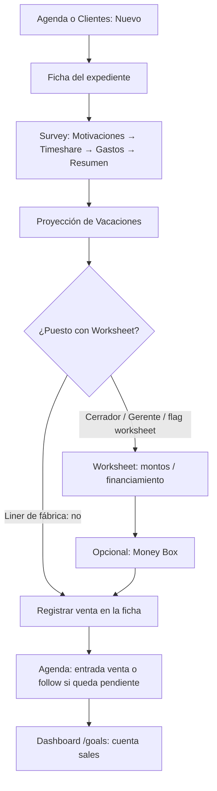
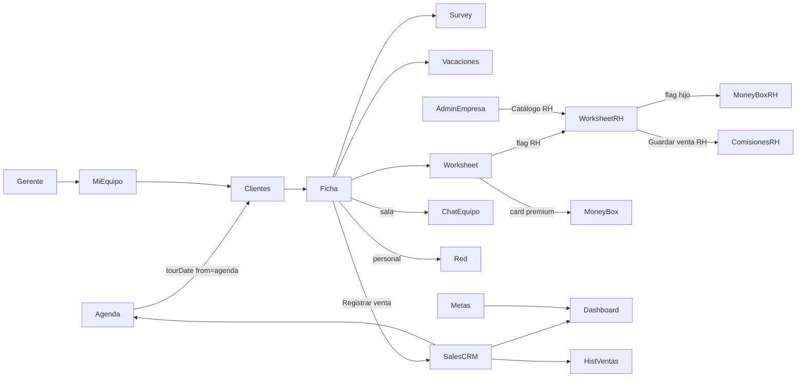

# Flujo de usuario por rol — Saletse

Mapa de **experiencia de pantalla**: qué se ve, a dónde se navega, y cómo cambian los módulos según el puesto. No describe arquitectura interna.

**Fecha:** 2026-09-02.  
**Fuente:** UI (`apps/web`) + catálogo de permisos/flags y seeds de puestos (`packages/shared`, `empresa-roles-seed.js`).  
**Profundidad técnica:** [`MAPA-GENERAL-SISTEMA.md`](./MAPA-GENERAL-SISTEMA.md) · [`RBAC-ADDITIVE.md`](./RBAC-ADDITIVE.md) · [`ARQUITECTURA-API.md`](./ARQUITECTURA-API.md) · [`royal-holiday/README.md`](./royal-holiday/README.md)  
**Sala Royal Holiday (Herramientas RH, Premanifiesto, venta `rh_ventas`):** [`FLUJO-USUARIO-ROYAL-HOLIDAY.md`](./FLUJO-USUARIO-ROYAL-HOLIDAY.md).

---

## Cómo leer este documento

Hay **tres capas** que el usuario percibe como “puedo / no puedo”. No son la misma:

| Capa | Qué controla en pantalla | Ejemplo |
|------|--------------------------|---------|
| **Menú** | Ítems del sidebar / barra inferior | “Mi equipo” solo si el workspace activo es sala **y** `rol_en_workspace === "gerente"` |
| **Flags / paquete del puesto** | Tarjetas de Herramientas y herramientas del expediente | Liner de sala: Survey + Vacaciones; Cerrador: Worksheet, Money Box, RH… |
| **Permisos (`permission_keys`) + API** | Muchas **acciones** (y casi siempre el servidor). Varias claves **no esconden** el botón; el API responde 403 | `expedientes:crear`, `ventas:cancelar` |

Si un puesto se reconfiguró en Admin → empresa (paquete, extras, delegación), lo que ve esa persona **puede diferir** del retrato “de fábrica” de abajo. El retrato de fábrica es el seed de `ensureEmpresaOperationalRoles`.

---

## 1. Desde el login

### Lo que aparece en pantalla, en orden

1. **`/login`** — correo y contraseña. Texto del botón: «Iniciar sesión». No hay selector de rol ni de sala en esta pantalla.
2. Tras un 200, la app pide la sesión y **entra a Agenda** (`/`). No hay wizard ni pantalla intermedia de “elige tu espacio”.
3. El **espacio activo** ya viene resuelto (`profiles.workspace_activo_id`). Si hay varios (personal + una o más salas), el cambio es un **selector en el rail izquierdo** (desktop) o en el avatar (móvil): hoja «cambiar de workspace», overlay «Cambiando a…». No es un paso obligatorio al entrar.
4. El menú de siempre (sidebar o barra inferior) ya está visible sobre Agenda.

Fallos que sí se ven:

- Cuenta desactivada → mensaje en el propio login (403).
- RPC de permisos o flags de sala caído → **banner o panel “Reintentar”** (no “no tienes permiso”). Detalle: mapa general §5.6.

### ¿La primera pantalla cambia según el rol?

**El destino es el mismo para todos: Agenda**, no el Dashboard (`/goals` es otra entrada del menú).

Lo que **sí** puede verse distinto **en el mismo segundo**, sin entrar a otro módulo:

| Quién | Menú extra / distinto en Agenda | Datos que ya “llegan” a Agenda / Clientes / Dashboard |
|-------|----------------------------------|--------------------------------------------------------|
| Liner, Cerrador, OPC, Marketing (sala) | Igual: Agenda, Metas, Clientes, Dashboard, Herramientas. **Sin** «Mi equipo». Chat de equipo en el header (no Red). «Ventas» solo si la sesión trae `sales:history`. | Sync **solo lo propio**, salvo que el puesto tenga `dashboard:ver_equipo` (de fábrica: Gerente). |
| Gerente de sala | Lo anterior **más «Mi equipo»**. Además suele aparecer **Admin** (ver §2.3): panel reducido. | Sync de equipo (`dashboard:ver_equipo`) → Agenda/Dashboard/Clientes muestran producción de la sala, no solo la suya. |
| Workspace **personal** | **Red** + **Mensajes** (no Chat de equipo). Sin «Mi equipo». | Solo expedientes del personal. |
| Superadmin / Admin de plataforma | Ítem **Admin** con pestañas según permisos de panel. | Depende del workspace que tengan activo (personal o una sala). |
| Admin de empresa (`empresa_miembros.es_admin`) | Ítem **Admin** con al menos Resumen + **Empresas**. | Igual: el CRM sigue el workspace activo, no “toda la empresa” en Agenda. |

Un Liner y un Gerente **no ven un Dashboard distinto como home**. Ven la misma Agenda; el Gerente tiene más entradas de menú y, de fábrica, **más datos de compañeros** en esos módulos.

---

## 2. El menú (todos los roles)

Definido en `nav-config.js` + `use-app-nav.js`. **Ningún ítem principal se oculta por `expedientes:*`, `agenda:usar` ni `dashboard:ver_propio`.**

| Ítem | Visible cuando |
|------|----------------|
| Agenda `/` | Siempre |
| Metas `/metas` | Siempre |
| Clientes `/clients` | Siempre |
| Mi equipo `/team` | Sala **y** rol de workspace `gerente`. Si alguien entra a `/team` sin ser gerente → redirige a Agenda. |
| Dashboard `/goals` | Siempre |
| Herramientas `/tools` | Siempre (el **contenido** del hub sí cambia por flags) |
| Ventas `/sales` | `sales:history` en `permission_keys` (o Admin de plataforma: atajo `sales:*`). Si no, el ítem no está; la ruta redirige a `/`. |
| Red `/network` | Solo workspace **personal** |
| Mensajes `/messages` | Solo **personal** |
| Chat equipo `/messages?scope=team` | Solo **sala** |
| Admin `/admin` | `GET /api/v1/admin/me` OK: rol plataforma `admin`, **o** admin de empresa, **o** gerente de sala (contexto tenant) |

Ajustes (`/settings`) no está en ese grupo; se abre desde el perfil / flujos de cuenta.

---

## 3. Qué ve cada rol

Convención de las tablas:

- **Ve / no ve** = ítem de menú o tarjeta en Herramientas (código de UI).
- **Puede** = acción que la UI ofrece **y** el API suele aceptar con el seed de fábrica.
- **Ve el botón, API puede negar** = el control está en pantalla sin `can("clave")`; el 403 es del servidor.

Puestos de **sala** (seed por empresa): `gerente`, `liner`, `cerrador`, `marketing`, `opc`, más asistentes. El rol de plataforma «Vendedor» fue migrado a **Liner** (`0069`).

### 3.1 Liner (sala)

**Paquete de flags de fábrica:** Survey (incl. pestañas) + Proyección de vacaciones. **No** Worksheet ni Money Box ni herramientas RH, salvo que la empresa se lo haya puesto en el paquete.

**Permisos de fábrica:** los del Liner de plataforma (app sin `*:ver_equipo`) + `workflow:ver` y `workflow:avanzar`. El pipeline de etapas **ya no existe**; esas claves de workflow **no abren una pantalla de pipeline** (sí alimentan capacidades de participantes).

| Módulo | ¿Lo ve? | Qué puede hacer | Qué no |
|--------|---------|-----------------|--------|
| Agenda | Sí | Alta de notas / descanso / no-tour; tipos venta-follow-nota cliente **saltan a Clientes** con fecha de tour. Ver entradas propias. | No ve producción de compañeros (sync filtrado). |
| Metas | Sí | Editar metas del mes (la página **no** pregunta `metas:ver_editar_propias`). | No hay vista “metas del equipo” en esta pantalla. |
| Clientes | Sí | Botón **Nuevo** siempre visible. Lista con columnas de equipo (vendedor/cerrador) en sala. Abrir expediente. Compartir si hay nube. Icono basura: dueño en **personal**, o **gerente** en sala (alineado con la ficha). | No es dueño de “toda la sala”: el listado remoto sigue el alcance del API (propios, salvo `ver_equipo`). |
| Mi equipo | **No** | — | `/team` redirige a Agenda. |
| Dashboard | Sí | KPIs de **sus** tours/ventas (`sales`) del blob. | No KPIs de compañeros. **No** comisiones RH. |
| Herramientas | Sí | Tarjetas Survey y Vacaciones. CTA «Nuevo expediente». | Sin Worksheet/RH de fábrica. |
| Ventas | Sí **si** tiene `sales:history` (el Liner de plataforma lo incluye). | Historial de ventas del blob; detalle si `sales:view_detail`. | — |
| Admin | No (salvo que también sea admin de empresa / plataforma). | — | — |
| Chat equipo | Sí (header) | Chat de sala + **Abrir chat del expediente** en la ficha. | Red social de contactos: no (solo personal). |

**En el expediente (sala):**

- Herramientas: las que el flag permita (Survey / Vacaciones).
- **Registrar venta:** visible si `can_edit` del API de participantes: dueño con `expedientes:editar`, **o** es el vendedor/cerrador asignado, **o** gerente / `workflow:revisar`, **o** `expedientes:editar` + `ver_equipo`. Un Liner **asignado** como vendedor **sí** puede editar y registrar venta.
- Asignar/reasignar vendedor o cerrador: **no** (eso es `isManager`).
- Compartir / duplicar / transferir: en sala `isRecordOwner` es **false** (solo workspace personal). No ve esos botones en sala.
- Eliminar: no en sala.

### 3.2 Cerrador (sala)

**Paquete de fábrica:** «Cierre» = módulos base **incluyendo Money Box** (todos los flags salvo hijos de Premanifiesto).

**Permisos extra vs Liner:** `workflow:ver`, `workflow:avanzar`, `workflow:cerrar`. Sigue **sin** `*:ver_equipo` de fábrica.

Menú: **igual que Liner** (sin Mi equipo).

Diferencia que el usuario nota:

- En **Herramientas** y en el expediente: Worksheet (regular o RH si el flag de empresa está on), Money Box, calculadoras RH si los flags `rh.tool.*` vienen en el paquete.
- En el expediente: si está **asignado como cerrador**, `can_edit` es true → Registrar venta, notas, tools.
- **No** asigna cerrador/vendedor (no es gerente).
- Dashboard/Agenda: **lo suyo**, no el equipo (de fábrica).

### 3.3 Gerente (sala)

**Paquete de fábrica:** «Operación base» (módulos de sala; no los flags hijos de Premanifiesto marketing/opc/rep/csi).

**Permisos extra:** `expedientes:ver_equipo`, `ventas:ver_equipo`, `dashboard:ver_equipo`, `metas:ver_equipo`, `workflow:ver`, `workflow:revisar`, `workflow:asignar_cerrador`.

| Módulo | Diferencia respecto a Liner/Cerrador |
|--------|--------------------------------------|
| Menú | **Mi equipo**. Suele verse **Admin** (Resumen) por contexto tenant — no es el panel de Superadmin. |
| Agenda / Dashboard / Clientes | Datos de **la sala** (teamScope). Columnas vendedor/cerrador en Clientes. |
| Expediente | `can_edit` por ser gerente. **Asignar / reasignar** Vendedor y Cerrador. **Eliminar** expediente (detalle). Chat del expediente. |
| Mi equipo | Invitar, cambiar puesto, ver expedientes de un miembro, extras de permisos (solo claves que ya tenga algún puesto de la empresa), delegación. |
| Admin | Pestaña Resumen (`ver_resumen`). **No** Empresas (`gestionar_empresas` es de admin de empresa). **No** Usuarios/Roles/Logs de plataforma. |

Publicar catálogo RH: **no** desde Mi equipo; está en Admin → Empresas → Catálogo RH, y la API exige **admin de empresa** (o Superadmin), no gerente.

### 3.4 Marketing y OPC (Royal Holiday)

No son un menú distinto: son **puestos de sala** con **otro paquete de flags**.

| | Marketing (fábrica) | OPC (fábrica) |
|--|---------------------|---------------|
| Flags | `worksheet`, `worksheet.royal_holiday`, `rh.tool.ops`, `rh.tool.premanifiesto`, `rh.tool.premanifiesto.marketing` | Igual, con `rh.tool.premanifiesto.opc` en lugar de `.marketing` |
| Herramientas | Worksheet **RH** + bloque «Administrativo operaciones» | Igual |
| Premanifiesto | Alta origen **marketing**; ve calendario/olas | Alta origen **opc** (lobby); edita las suyas pendientes sin rep |
| Survey / Vacaciones | De fábrica **no** (el paquete no los incluye) | Igual |
| Menú CRM | Igual que Liner (Agenda, Clientes…) | Igual |

Permisos de catálogo: el seed les copia la **misma base que Liner** + `workflow:ver` / `avanzar`. **Sin confirmar** si en producción alguna empresa les recortó `ventas:*` o `expedientes:*`.

Otros flags de Premanifiesto (`premanifiesto.rep`, `.csi`): no son un puesto seed; se otorgan por paquete/flag. CSI/Rep **leen** el premanifiesto (`useRhPremanifiestoAccess`) sin crear show de marketing/opc.

### 3.5 Asistente de sala / de empresa

Seed: **sin** `rol_permisos` de catálogo; el acceso es `permisos_delegados` (techo del delegante).

- Menú principal: **el mismo** (no hay `asistenteOnly` en nav).
- Acciones: `can()` fail-closed si no hay claves. Qué ve en Herramientas depende de flags de sesión — **sin confirmar** el mapa de flags de un asistente recién creado.
- No aparece «Mi equipo» (no es `gerente`).

### 3.6 Workspace personal (Liner de plataforma)

Quien trabaja en su espacio personal (típico al registrarse, o al salir de una sala):

| Ve | No ve |
|----|--------|
| Agenda, Metas, Clientes, Dashboard, Herramientas, Ventas (si `sales:history`) | Mi equipo, Chat de equipo |
| **Red** y **Mensajes** | Columnas de equipo en Clientes |
| En el expediente: Compartir, Duplicar, **Transferir a sala**, Eliminar (es dueño) | Panel de participantes (solo sala) |

Herramientas: flags de **membresía/plan**, no del paquete de sala. Worksheet RH solo si el flag está on en esa sesión.

### 3.7 Admin de empresa

No es un slug de `roles` de sala: es `empresa_miembros.es_admin = true`.

- CRM: el del **workspace que tenga activo** (puede ser personal o una sala). El menú CRM no se “convierte” en panel corporativo.
- **Admin** en el menú. Pestañas de fábrica del contexto tenant: **Resumen** + **Empresas** (`gestionar_empresas` se inyecta en `/admin/me`, no está en el catálogo `capa:app`).
- En Empresas: salas, miembros, branding, **puestos/paquetes**, **Catálogo RH** (publicar versión), módulos custom. API: `requireEmpresaAdmin`.
- **No** gestiona otros Admins de plataforma, logs globales, ni `capa: admin` del panel (atajo tenant excluye esas claves: [`RBAC-ADDITIVE.md`](./RBAC-ADDITIVE.md)).

### 3.8 Admin de plataforma vs Superadmin

`profiles.role === "admin"`. El ítem Admin usa `hasAnyAdminAccess` / `/admin/me`.

Pestañas (`admin-topbar-tabs.jsx` + `ADMIN_NAV_PERMISSIONS`):

| Pestaña | Permiso | Superadmin | Admin delegado |
|---------|---------|------------|----------------|
| Resumen `/admin` | `ver_resumen` | Sí | Si se lo asignaron |
| Usuarios | `gestionar_usuarios` | Sí | Delegable |
| Roles | `gestionar_roles_permisos` | Sí | **Solo Superadmin** de fábrica (`SUPERADMIN_ONLY_KEYS`) |
| Módulos `/admin/modules` | (ruta: solo Superadmin) | Sí | **No** (filtro de tabs: sin permiso mapeado → oculto) |
| Empresas | `gestionar_empresas` | Super entra por atajo de código; clave no está en el catálogo `PERMISSION_CATALOG` | Admin de empresa (inyección tenant), no el Admin de plataforma típico |
| Logs | `ver_logs` | Sí | No de fábrica |
| Metas / Métricas / Soporte | `gestionar_metas`, `ver_metricas`, `gestionar_soporte` | Sí | Delegables |
| Exports CSV, cambiar plan, desactivar, gestionar permisos de funciones | claves `capa: admin` | Super las tiene todas; asignar plan/desactivar/gestionar_permisos **solo Superadmin las otorga** | Según `admin_permissions` |

Un Admin **no** puede mutar a otro Admin (peer isolation). Detalle: ficha técnica §5.3.

### 3.9 Soporte (plataforma)

Rol sistema `soporte`: app base + `gestionar_soporte`. El ítem Admin exige `role === "admin"` **o** contexto tenant. Un usuario **solo** `soporte` **sin** `profiles.role = admin` — **sin confirmar** que vea el ícono Admin; el ticket se atiende desde `/admin/support` si llega a entrar al panel.

---

## 4. Acciones concretas: quién ve el control

Gateado **en UI** (código), no “en espíritu”:

| Acción | Dónde | Quién la ve | Clave de catálogo usada en el botón |
|--------|-------|-------------|-------------------------------------|
| Nuevo expediente | Clientes, Herramientas | **Todos** los que llegan a la pantalla | **Ninguna** (`expedientes:crear` no oculta el botón) |
| Eliminar en **lista** Clientes | Icono basura | Dueño en **personal**, o **gerente** en sala (no pines) | Ninguna; misma regla que la ficha |
| Eliminar en **ficha** | Detalle | Dueño en **personal**, o **gerente** en sala | Ninguna; no usa `expedientes:eliminar` |
| Compartir | Lista y ficha | Lista: si hay nube. Ficha: dueño en **personal** | No usa `expedientes:compartir` |
| Transferir a sala | Ficha | Solo dueño en personal | — |
| Registrar venta | Ficha | `can_edit` (participantes) | No usa `ventas:registrar` en el botón |
| Estado **Cancelada** | Modal de venta (`client-record-modal`) | Quien puede abrir el modal de edición | El select **incluye** cancelada; **no** se oculta con `ventas:cancelar` (el PATCH API sí la exige) |
| Historial Ventas | Menú | `sales:history` | Sí (`hasUserFeature`) |
| Survey / Vacaciones / Worksheet | Hub y ficha | Flag de sesión (o permiso legacy si no hay catálogo) | Flags `survey`, `proyeccion_vacaciones`, `worksheet` |
| Configurar preguntas Survey | Survey | `herramientas:survey_configurar_preguntas` | Sí |
| Money Box standalone | Card premium | Flag `worksheet.money_box` o plan PRO | `useFeatureAccess` |
| Pestaña Money Box **dentro** de Worksheet RH | Worksheet RH | `worksheet.royal_holiday.money_box` | Sí |
| Asignar cerrador / vendedor | Panel Colaboración | `capabilities.can_assign_*` (gerente / `workflow:revisar` / `ver_equipo` / admin empresa / super) | No el botón `workflow:asignar_cerrador` en UI; el API de participantes sí usa `isManager` |
| Publicar catálogo RH | Admin → Empresas → Catálogo RH | Quien entra a esa pestaña (admin empresa / super) | API `requireEmpresaAdmin` |
| Invitar a la sala | Mi equipo | Solo gerente | Ruta `/team` |

---

## 5. Recorrido de un cliente nuevo

### 5.1 Cómo se crea el expediente

Tres entradas de UI, **el mismo modal**:

1. **Clientes** → botón «Nuevo».
2. **Agenda** → nueva entrada tipo **venta / follow / nota de cliente** → navega a `/clients?tourDate=YYYY-MM-DD&from=agenda` y abre el modal con esa fecha de tour.
3. **Herramientas** → «Nuevo expediente» (opcionalmente adopta calculadoras hechas en modo libre).

No hay alta desde Dashboard ni desde Admin.

**Datos al crear (obligatorios):** un solo nombre (sin espacios) y **tipo de tour**. Opcional: tour cuantificable (default sí). La fecha de tour se rellena si se vino de Agenda.

Tras crear: se abre la **ficha** `/clients/:id` (desde Herramientas; desde Clientes el usuario abre la fila).

### 5.2 Orden natural en una venta (sala, Worksheet regular)

Lo que un Liner haría con el paquete de fábrica:

En la ficha, las tarjetas no imponen un wizard: el orden es el que el vendedor elija. Survey internamente sí tiene «Guardar y continuar» entre pestañas (si el flag de cada tab está on).

**Cerrador / Gerente** (o Liner si la empresa le dio Worksheet): después del discovery entran a Worksheet estándar (campos de venta/enganche/financiamiento de la calculadora genérica) y pueden abrir Money Box si el flag/plan lo permite.

### 5.3 Si el workspace tiene Worksheet Royal Holiday

El flag `worksheet.royal_holiday` **sustituye** el Worksheet estándar (misma ruta `/clients/:id/worksheet`).

Pestañas, en este orden en código:

1. Datos Financiamiento  
2. Datos Venta  
3. Money Box (solo con flag hijo)  
4. Worksheet (hoja / firmas)

Flujo de usuario típico en RH: Financiamiento → Venta → (Money Box) → Worksheet → **guardar venta RH** (toast «Venta Royal Holiday guardada»). Eso **no** es el botón «Registrar venta» de la ficha: son dos registros distintos (`rh_ventas` vs `sales`). El Dashboard de `/goals` **no** se alimenta de la venta RH. Las comisiones y Extra DP viven en herramientas RH (calendario de comisiones) y el cron de Extra DP.

Detalle de catálogo/flags: [`royal-holiday/README.md`](./royal-holiday/README.md).

### 5.4 Qué pasa al guardar y quién más lo ve

| Qué se guardó | Dónde lo ve el autor | Quién más lo ve |
|---------------|----------------------|-----------------|
| Expediente + tools | Clientes, ficha, calculadoras | En **sala**, compañeros con `ver_equipo` / teamScope (Gerente de fábrica). El **cerrador/vendedor asignado** edita el **mismo** expediente (no una copia). Chat grupal del expediente. |
| Venta `sales` | Ficha, Agenda (día de venta o follow de proceso), Dashboard, historial Ventas | Misma regla de equipo. Pendiente + follow-up → recordatorio / digest. |
| Venta RH | Calendario de comisiones RH, extras en Agenda como follows | Quien tenga las tools RH y alcance de empresa; **no** el KPI de `/goals`. |
| Pin de un compartido | Lista Clientes del receptor (fila pin) | Sigue siendo el expediente **del dueño**; el receptor no se lleva una copia. |

«La sala es dueña de la info» en UX: en sala no ves Transferir/Compartir como dueño personal; ves Colaboración (gerente/vendedor/cerrador) y, si eres gerente, el equipo entero en listados y Dashboard.

---

## 6. Cómo se conectan los módulos

| Desde | Hacia | Cómo lo nota el usuario |
|-------|-------|-------------------------|
| Agenda | Clientes | Entrada venta/follow/nota cliente abre el alta con fecha de tour. «Ir al expediente» si la entrada ya tiene cliente. |
| Clientes | Ficha → tools | Tarjetas Survey / Vacaciones / Worksheet según flags. |
| Worksheet | Money Box | Card debajo de Worksheet (regular) o pestaña (RH). |
| Ficha | Agenda | Registrar venta crea día de venta o follow de procesamiento. |
| Ficha | Dashboard | Solo ventas `sales` contables del mes. |
| Ficha | Chat equipo | «Abrir chat del expediente» (sala). |
| Ficha | Red | Compartir (personal). El pin aparece en Clientes del receptor. |
| Mi equipo | Clientes | Modal de expedientes de un miembro. |
| Admin Empresas | Worksheet RH | Publicar catálogo: números que el vendedor ve en preview. |
| Metas | Dashboard | Objetivos del mes que el Dashboard compara con lo real. |
| Herramientas (libre) | Clientes | «Nuevo» + adoptar calculadoras sueltas al expediente. |
| Premanifiesto (ops RH) | Calendario widget | Independiente de la Agenda CRM. |

Lo que **no** está conectado (y se siente como hueco si se espera):

- Venta RH ↛ Dashboard `/goals`.
- Analysis existe como **ruta** `/clients/:id/analysis` pero **no** hay tarjeta en el hub ni en la ficha (ver hallazgos aparte).

---

## 7. Recordatorio para quien configure puestos

El menú **no** se recorta con el catálogo `capa:app`. Recortar Survey/Worksheet es **flags / paquete**. Recortar “ver al equipo” es **`*:ver_equipo`**. Recortar el panel de plataforma es **`capa: admin`** y `profiles.role`. Fórmula aditiva y atajos: [`RBAC-ADDITIVE.md`](./RBAC-ADDITIVE.md).
