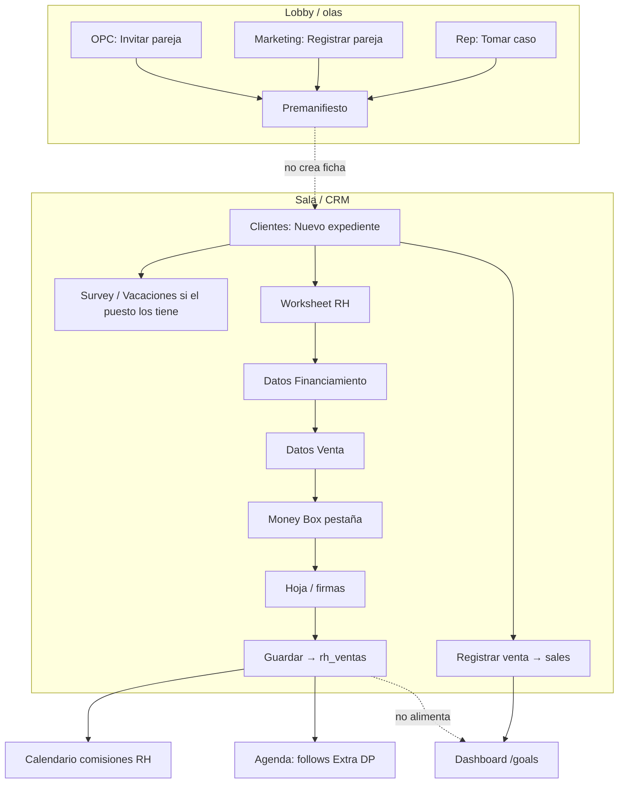
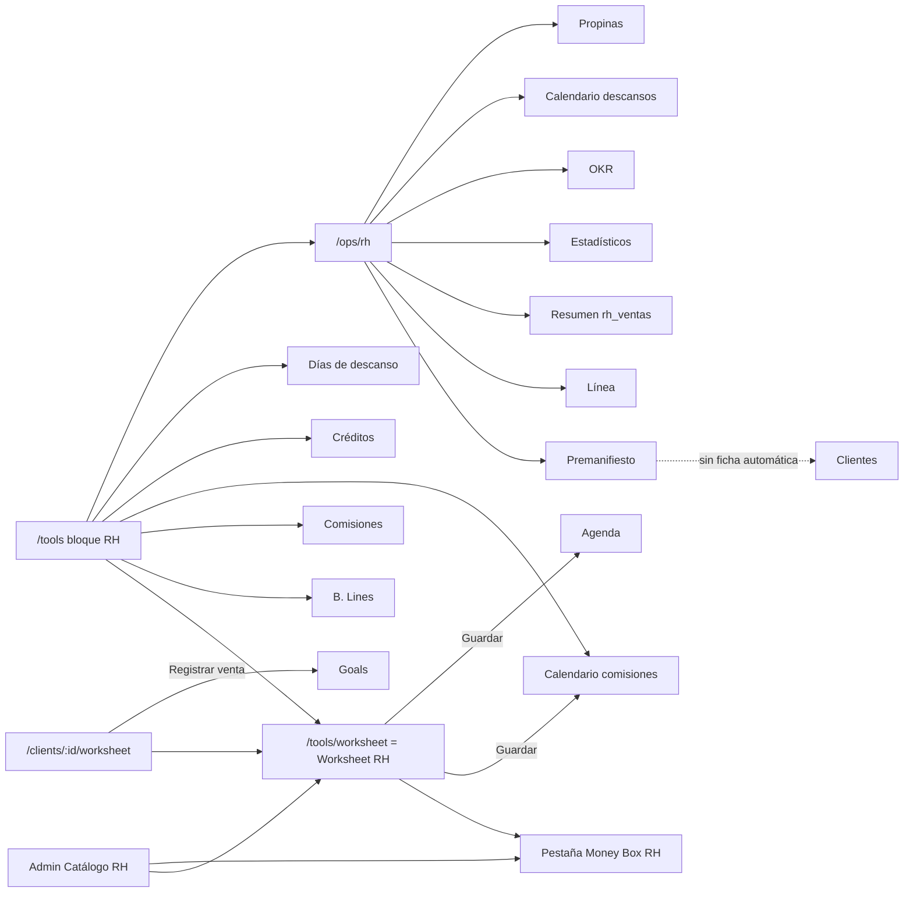

# Flujo de usuario — workspace Royal Holiday

Experiencia de pantalla **dentro de la sala Royal Holiday**. Complementa [`FLUJO-USUARIO-POR-ROL.md`](./FLUJO-USUARIO-POR-ROL.md) (menú CRM, permisos de expediente, login). Aquí solo lo que **cambia o se añade** cuando el workspace activo es esa sala.

**Fecha:** 2026-09-02.  
**Fuente:** UI RH, flags/paquetes de bootstrap, `empresa-roles-seed.js`, `seed-rh-tool-flags.mjs`, `0085`.  
**Catálogo / APIs:** [`royal-holiday/README.md`](./royal-holiday/README.md).  
**CSI (proceso, no UX de botones):** [`royal-holiday/PREMANIFIESTO-CSI-CAPACITACION.md`](./royal-holiday/PREMANIFIESTO-CSI-CAPACITACION.md).

Este retrato es el **de fábrica tras bootstrap RH** (empresa «Royal Holiday», sala «Sala Royal Holiday»). Si Admin recortó paquetes, la pantalla puede diferir. Donde el código de seed genérico de empresa **choca** con el bootstrap RH, se dice explícitamente.

---

## 1. Cómo se “entra” a Royal Holiday

No hay app aparte ni login distinto.

1. Mismo `/login`.
2. Home = **Agenda** (`/`).
3. En el **selector de workspace** (rail / avatar) el usuario elige **Sala Royal Holiday** (tipo `sala_de_venta`, `empresa_id` de Royal Holiday). Overlay «Cambiando a…», branding de la sala.
4. La sesión recalcula **flags tenant**. Ahí aparece `worksheet.royal_holiday` (y el resto del paquete del puesto).

Si se queda en el workspace **personal**, **no** ve el bloque RH en Herramientas: el flag es custom de esa empresa.

El bootstrap deja al gerente de referencia (`eduardolalito99@hotmail.com`) también como **admin de empresa**. Eso no es cierto de todo gerente de sala: es de esa semilla.

---

## 2. Qué cambia en el menú (casi nada)

El sidebar **no** gana un ítem “Royal Holiday”. Sigue: Agenda, Metas, Clientes, Dashboard, Herramientas, (Mi equipo si gerente), Ventas si `sales:history`, Chat de equipo.

Lo que cambia es **el interior de Herramientas** y de **Worksheet** en el expediente.

Título del bloque RH en el hub (todos los puestos): «Herramientas Royal Holiday».

---

## 3. Mapa de flags que el usuario percibe

Jerarquía (si el padre está off, el hijo está off):

```
worksheet
 └── worksheet.royal_holiday          → variante de Worksheet + bloque RH del hub
      ├── worksheet.royal_holiday.money_box   → pestaña Money Box dentro del Worksheet RH
      └── rh.tool.* (calculadoras, descansos, ops)
           └── rh.tool.premanifiesto
                ├── .marketing
                ├── .opc
                ├── .rep
                └── .csi
```

`0085` mete `worksheet` (padre estándar) en los paquetes `operacion-base`, `cierre` y **`liner`** de la empresa que ya tiene Money Box RH. Sin ese padre, el Liner no vería la variante RH aunque tuviera el hijo en el paquete.

Rutas `/tools/rh/*` y `/ops/rh/*` usan `FlagsUnavailableGate` (RPC caído) **y** `RhToolFlagGate` (mismo criterio que el hub: flag hijo en `false` redirige a `/tools`). Premanifiesto sigue con `RhPremanifiestoGate`.

Excepción en el hub: si `worksheet.royal_holiday` está on y el flag hijo **aún no viene en sesión** (`null`), `rhToolOn` **muestra** la tarjeta. Con catálogo cargado, un flag en `false` sí oculta.

---

## 4. Qué ve cada puesto en esta sala

Paquetes seed RH (no el seed genérico de “cualquier empresa”):

| Puesto | Paquete | Flags que importan en pantalla |
|--------|---------|--------------------------------|
| Gerente | `operacion-base` | `worksheet` + RH + **todos** `rh.tool.*` **excepto** hijos `.marketing/.opc/.rep/.csi` |
| Cerrador | `cierre` | Igual que gerente en flags (incluye Money Box RH) |
| Liner | `liner` | Survey + vacaciones **y, en RH**, `worksheet` + `worksheet.royal_holiday` + money_box tab + `rh.tool.*` menos hijos Premanifiesto (`bootstrap` + `0085` + `seed-rh-tool-flags`). **No** es el Liner genérico “solo Survey”. |
| Marketing | `marketing` | `worksheet`, RH, `rh.tool.ops`, `rh.tool.premanifiesto`, `.marketing`. **Sin** Survey/Vacaciones ni calculadoras B.Lines/Comisiones/Créditos/Descansos de fábrica. |
| OPC | `opc-lobby` | Igual que Marketing, con `.opc` en lugar de `.marketing`. |
| Rep (no es slug de puesto) | flag `.rep` encima de otro puesto | Premanifiesto: **Tomar caso**. |
| CSI | flag `.csi` (delegación) | Lectura CSI según RPC; **sin** botón propio en el hub. |

### 4.1 Liner (sala RH)

| Superficie | Qué ve | Qué no / matices |
|------------|--------|-------------------|
| Menú CRM | Igual que cualquier Liner de sala (sin Mi equipo). | — |
| Herramientas | Bloque RH: Worksheet, B. Lines, Comisiones, Calendario comisiones, Créditos, Días de descanso. **Operaciones sala** (`rh.tool.ops`). Abajo: Survey y Vacaciones. | No ve hijos Premanifiesto → no «Registrar/Invitar pareja». |
| Expediente | Tarjetas Survey, Vacaciones **y Worksheet** (la ruta abre **Worksheet RH**, no el estándar). Money Box como **pestaña** del RH, no la card PRO suelta (el hub no pone Money Box premium bajo Worksheet cuando RH está on). | Analysis sigue sin tarjeta. |
| Premanifiesto | Puede **abrir** el módulo (lectura vía `ops` / `premanifiesto` padre). Calendario de olas. | Sin botones de alta. `readOnly` en el hook si no es marketing/opc/rep. |
| Dashboard `/goals` | Tours/ventas **`sales`**, no `rh_ventas`. | Guardar en Worksheet RH **no** mueve estos KPIs. |

### 4.2 Cerrador (sala RH)

Misma Herramientas RH que el Liner (paquete `cierre` trae los mismos `rh.tool.*` no-hijo). Diferencia CRM: en el expediente, si está **asignado cerrador**, puede registrar venta `sales` y editar ficha. Sigue **sin** Mi equipo y **sin** datos de todo el equipo en Dashboard (no tiene `ver_equipo` de fábrica).

En Worksheet RH puede **Guardar** (venta `rh_ventas`) si no está `readOnly` (compartido / sin `can_edit`).

### 4.3 Gerente (sala RH)

| Superficie | Qué ve |
|------------|--------|
| Menú | + **Mi equipo**. En la semilla de bootstrap, + **Admin** (es admin de empresa) → Empresas / Catálogo RH. Un gerente **sin** `es_admin` solo tendría Resumen de tenant, no Catálogo. |
| Herramientas | Mismo bloque RH + Operaciones. |
| Premanifiesto | Lectura (flag `ops`). **No** «Registrar pareja» salvo que le hayan puesto `.marketing`. CSI: la API puede proyectar notas; la UI muestra CSI si el payload trae `notas_csi`. |
| Ops (Línea, Resumen, OKR, Descansos, Propinas) | Tarjetas visibles en `/ops/rh` (no tienen `readFlags` en el hub). API exige `rh.tool.ops`. |
| Catálogo RH | Solo si entra a Admin → Empresas (admin empresa / super). Publicar versión, olas, Money Box planes. |

### 4.4 Marketing

| Superficie | Qué ve | Qué no |
|------------|--------|--------|
| Herramientas | Worksheet RH + **Operaciones sala**. | De fábrica **no** Survey, Vacaciones, B. Lines, Comisiones, Créditos, Días de descanso (flags ausentes → tarjetas ocultas). |
| Premanifiesto | Botón **«Registrar pareja»** (origen marketing). Edita el día. Datos comerciales editables. CSI en alta. | No «Invitar pareja» (ese texto es solo OPC). |
| CRM Clientes | El menú está; el paquete no quita Clientes. Puede crear expediente como cualquiera (botón no gateado). | Survey/Vacaciones en la ficha: ocultos si los flags están off. Worksheet RH **sí**. |

Alta en Premanifiesto **no crea expediente** en Clientes (`prospect_nombre` nomas). El CRM se llena cuando alguien crea el expediente a mano.

### 4.5 OPC (lobby)

| Superficie | Qué ve |
|------------|--------|
| Herramientas | Como Marketing: Worksheet RH + ops. |
| Premanifiesto | Botón **«Invitar pareja»**. Comercial **bloqueado** (rate/total/regalo/calif/concierge en solo lectura). Editar solo **sus** invitaciones `origen=opc`, `pendiente`, creadas por él. |
| CSI | Solo en sus invitaciones pendientes (si el API lo manda). |

No hay puesto “OPC” en el menú; es el mismo shell de sala.

### 4.6 Rep (flag `.rep`)

No hay tarjeta «Rep» en el hub. En Premanifiesto, en cada pareja pendiente sin `rep_id`: **«Tomar caso»**. Tras tomar, el circuito comercial se desbloquea en API (rep asignado). **Sin confirmar** en UI qué más se habilita en la ficha CRM al tomar caso (no hay enlace automático a `/clients/:id` en el botón).

### 4.7 Admin de empresa RH / Superadmin

Catálogo y olas: Admin → Empresas → **Catálogo RH** (y olas Premanifiesto). El vendedor no publica tablas: consume la versión vigente en preview/Guardar.

---

## 5. Recorrido de un show / venta en esta sala

Dos caminos que **conviven** y no se sustituyen.



### 5.1 Antes de la ficha (opcional)

1. Ops → Premanifiesto → día / ola (cupo `ocupado/cupo_max`).
2. Marketing registra o OPC invita.
3. Rep toma el caso.
4. **Sigue haciendo falta** crear el expediente en Clientes (nombre + tipo de tour), igual que en el resto de Saletse. Desde Agenda, `tourDate` + `from=agenda` abre el mismo modal.

### 5.2 En la ficha — Worksheet RH (orden de pestañas)

1. **Datos Financiamiento** — plazos/factores del catálogo, nacionalidad, enganche.  
2. **Datos Venta** — HC, regalos, cruce vs bottom line.  
3. **Money Box** — solo si `worksheet.royal_holiday.money_box`; planes de `rh_money_box_config` (no el Money Box PRO).  
4. **Worksheet** — hoja / firmas (campo Promotor ← `form.opc`).

Botón **Guardar**: persiste el bucket **y** `POST .../ventas` → `rh_ventas` + extras + movimiento de comisión inicial. Toast: «Venta Royal Holiday guardada». Posición en el form: `liner | closer | ftb | opc | x`.

**Registrar venta** en la cabecera de la ficha sigue siendo el flujo `sales` (Dashboard). En una venta típica RH el cerrador puede hacer **ambos**, o solo RH: no hay wizard que lo unifique.

### 5.3 Después de Guardar (RH)

| Dónde | Qué aparece |
|-------|-------------|
| Calendario comisiones (`/tools/rh/calendario-comisiones`) | Movimientos `inicial` / luego Extra DP |
| Agenda CRM | Follows de Extra DP/CC programados |
| Resumen ops / Estadísticos | Conteos de `rh_ventas` (día/semana/mes, por posición) |
| Dashboard `/goals` | **No** por este Guardar |
| Extra DP a 90 días | Cron / recálculo de comisión; forfeit si vence |

Quién más ve la venta RH: quien tenga las tools de catálogo/comisiones y alcance de empresa (`rh_can_access_empresa`). El Gerente con `ver_equipo` ve el **expediente** y las ventas `sales` de la sala; las `rh_ventas` no pasan por el blob `sts4_v1`.

---

## 6. Relación de módulos (solo RH)



| Conexión | Qué nota el usuario |
|----------|---------------------|
| Hub Worksheet = ficha Worksheet | Misma variante RH; modo libre vs ligado a expediente. |
| B. Lines / Comisiones / Créditos | Calculadoras **sueltas** (no graban `rh_ventas`). Mismo catálogo que el preview. |
| Calendario comisiones | Lista lo **guardado** como venta RH, no el Dashboard. |
| Días de descanso (tools) vs Calendario descansos (ops) | Dos pantallas: registro vs vista gerencial. |
| OKR de sala | Metas propias de `rh_okr`; **no** escribe en `/goals`. |
| Admin Catálogo | Cambia números que el vendedor ve al instante en preview. |
| Premanifiesto ↔ Clientes | **No** hay botón «crear expediente desde esta pareja». |
| Premanifiesto ↔ Agenda CRM | Widget de calendario **propio**; no son las `calendar_entries` de ventas. |

---

## 7. Acciones RH: quién ve el control

| Acción | Pantalla | Visible si | API |
|--------|----------|------------|-----|
| Bloque RH en Herramientas | `/tools` | `worksheet.royal_holiday` | — |
| Operaciones sala | `/tools` | ese flag **y** `rh.tool.ops` (o hijo ausente en sesión) | `rh.tool.ops` |
| Card Premanifiesto | `/ops/rh` | alguno de `ops` / `premanifiesto` / `.marketing/.opc/.rep/.csi` | lectura RPC |
| Registrar pareja | Premanifiesto | `.marketing` | `.marketing` |
| Invitar pareja | Premanifiesto | `.opc` y no marketing | `.opc` |
| Editar invitación OPC | Fila | OPC + suya + pendiente | `.opc` |
| Tomar caso | Fila | `.rep` | `.rep` |
| Pestaña Money Box RH | Worksheet | `worksheet.royal_holiday.money_box` | GET config: mismo flag |
| Guardar venta RH | Footer Worksheet | no `readOnly` | `worksheet.royal_holiday` |
| Publicar catálogo | Admin Empresas | admin empresa / super | `requireEmpresaAdmin` |
| Línea / OKR / Propinas / Resumen ops | `/ops/rh/*` | card siempre si entró al hub ops | `rh.tool.ops` |

---

## 8. Qué no cambia respecto al resto de Saletse

Sigue valiendo el mapa general de roles: Alta de expediente, Colaboración gerente/vendedor/cerrador, Chat de equipo, `sales` → Agenda/Dashboard, eliminar ficha (gerente), Mi equipo.

Royal Holiday **añade** un piso operativo (olas + catálogo + `rh_ventas`) encima de ese CRM; no lo reemplaza.
