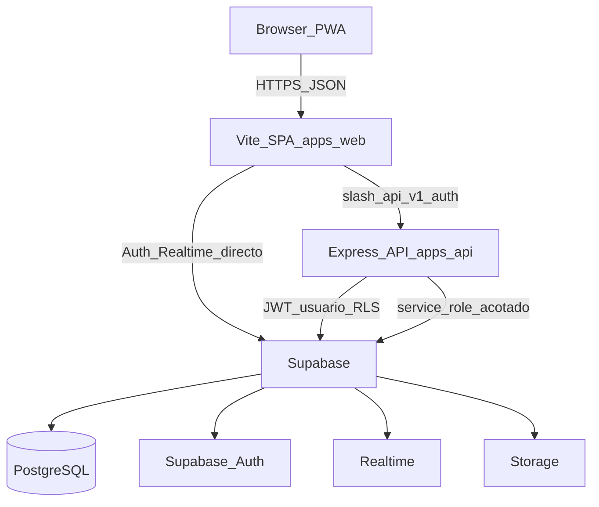
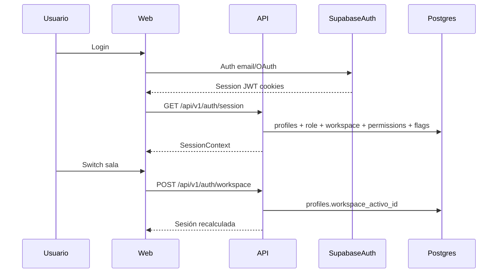
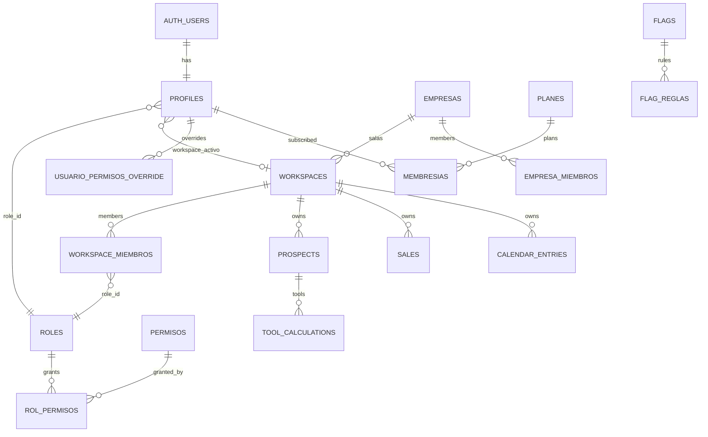
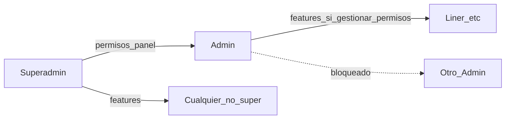

# Salètse — Información técnica del sistema

Ficha de producto, stack y modelo. **Mapa de onboarding (código actual, punta a punta):** [`MAPA-GENERAL-SISTEMA.md`](./MAPA-GENERAL-SISTEMA.md). **UX por rol:** [`FLUJO-USUARIO-POR-ROL.md`](./FLUJO-USUARIO-POR-ROL.md). **Sala Royal Holiday:** [`FLUJO-USUARIO-ROYAL-HOLIDAY.md`](./FLUJO-USUARIO-ROYAL-HOLIDAY.md).

> Producto: plataforma SaaS de ventas para timeshare / clubes vacacionales (agenda, expedientes, herramientas comerciales, metas, red, workspaces personal/sala).  
> Repositorio: monorepo `sales-app` (npm workspaces).  
> Producción: ver el mapa (VPS self-hosted; alias Vercel histórico).  
> Migraciones SQL: `0001` … `0090` (gap histórico `0024`). Este archivo nació citando hasta `0075`; el detalle de corte está en el mapa §7.

---

## 1. Resumen ejecutivo

| Aspecto | Detalle |
|--------|---------|
| Tipo | SaaS multi-workspace (empresa → sala de ventas → datos operativos) |
| Frontend | Vite 6 + React 19 + React Router 7 + PWA |
| Backend | Express 4 (Node.js, ESM/JavaScript) |
| Datos / Auth | Supabase (PostgreSQL + Auth + Realtime + Storage + RLS) |
| Estado cliente | Zustand + persistencia local (offline-first) + sync a nube |
| Shared | `@salesapp/shared` — permisos, mappers, validators, sync |
| Deploy | Vercel (SPA + API serverless `api/index.mjs`) |
| Idiomas UI | ES / EN |
| Calidad | Playwright e2e + scripts `verify*` |

### Actores principales

| Actor | Qué hace |
|-------|----------|
| **Superadmin** | Único administrador principal; panel completo; otorga permisos sensibles; puede mutar a otros Admins |
| **Admin** | Panel de plataforma (secciones delegadas); **no** puede modificar a otros Admins |
| **Gerente** (tenant/sala) | Equipo, asignación, `*:ver_equipo`, acceso cruzado opcional |
| **Liner** | Rol operativo de apertura (Survey + proyección; por paquete) |
| **Cerrador** | Rol de cierre con módulos comerciales completos |
| **Soporte** | Tickets de ayuda |

---

## 2. Stack tecnológico

### 2.1 Frontend (`apps/web`)

| Tecnología | Uso |
|------------|-----|
| Vite 6 | Build y dev server |
| React 19 | UI |
| React Router DOM 7 | Routing SPA |
| Zustand | Estado global (DB local, sync, app) |
| Tailwind CSS 3 | Estilos utilitarios |
| Lucide React | Iconografía |
| Recharts | Gráficas (metas / métricas) |
| @dnd-kit | Drag & drop |
| vite-plugin-pwa | PWA / service worker |
| Sentry (browser) | Observabilidad (opcional) |
| OneSignal | Push notifications (cliente) |

### 2.2 Backend (`apps/api`)

| Tecnología | Uso |
|------------|-----|
| Express 4 | HTTP API |
| Node.js (ESM) | Runtime |
| @supabase/supabase-js / ssr | Cliente Supabase (anon + service role) |
| cookie-parser, cors, compression | Infra HTTP |
| Resend | Email (soporte) |
| dotenv | Variables de entorno |

**Estilo:** thin router + fat service (`routes/` → `services/` → Supabase/RPC).

### 2.3 Datos e infraestructura

| Tecnología | Uso |
|------------|-----|
| PostgreSQL (Supabase) | Base de datos principal |
| Supabase Auth | Login, JWT, sesión |
| Supabase Realtime | Presencia, chat, sync reactivo |
| Supabase Storage | Logos, adjuntos soporte, archivos de expediente |
| Row Level Security (RLS) | Aislamiento por workspace / permisos |
| Migraciones SQL | `supabase/migrations/` (`0001` → `0075`) |

### 2.4 Calidad y tooling

| Herramienta | Uso |
|-------------|-----|
| Playwright | E2E |
| `npm run verify` | Smoke general |
| `npm run db:migrate -- NNNN` | Aplicar migración SQL vía `DATABASE_URL` |
| TypeScript (dev) | Tipado parcial en web / shared |
| npm workspaces | Monorepo |

### 2.5 Integraciones externas

- **OneSignal** — push  
- **Resend** — correo de soporte  
- **Sentry** — errores (opcional)  
- **Vercel Cron** — jobs (`CRON_SECRET`)

---

## 3. Estructura del monorepo

```
sales-app/
├── apps/
│   ├── web/                 # SPA Vite + React
│   │   └── src/
│   │       ├── components/  # UI por dominio
│   │       ├── pages/       # Páginas de ruta (app + admin activas)
│   │       ├── layouts/
│   │       ├── hooks/
│   │       ├── stores/      # Zustand
│   │       ├── lib/         # i18n, auth, sync, currency…
│   │       ├── routes/
│   │       └── styles/
│   └── api/                 # Express
│       └── src/
│           ├── routes/      # v1.js, admin.js, auth.js
│           ├── services/
│           ├── middleware/  # auth, admin-auth, rate-limit
│           ├── controllers/ # algunos dominios (custom modules, delegación)
│           └── lib/
├── packages/shared/         # Auth catalog, validators, mappers, sync
├── supabase/migrations/     # Schema versionado
├── docs/                    # Documentación (este archivo = maestro)
├── scripts/                 # Seed, migrate genérico, verify, ops Vercel
│   └── _archive/            # One-shots históricos (no usar en día a día)
├── e2e/                     # Playwright
├── api/index.mjs            # Entrada serverless Vercel
└── public/                  # Assets estáticos
```

### Comandos habituales

```bash
npm install
npm run dev:api          # API ~:4000
npm run dev:web          # Web ~:5173 (proxy /api, /auth)
npm run build            # Build web → apps/web/dist
npm run start:prod       # Sirve build + API
npm run db:migrate -- 0075
npm run verify           # Smoke
npm run test:e2e         # Playwright
node scripts/promote-saletse-alias.mjs   # Alias producción saletse.vercel.app
```

---

## 4. Arquitectura lógica



### Capas de responsabilidad

| Capa | Responsabilidad |
|------|-----------------|
| UI | Captura, calculadoras, listados, admin |
| Store local | Caché offline + dirty sync |
| API | Autorización, validación, operaciones sensibles |
| PostgreSQL + RLS | Persistencia e aislamiento |
| Shared | Catálogo de permisos, validadores, mappers |

### Frontera de datos (multi-workspace)

```
Sistema (global)
 └── Empresa (tenant comercial)
      └── Sala de ventas (workspace tipo sala_de_venta)
           └── Expedientes, ventas, agenda, tools…
 └── Workspace personal (por usuario)
      └── Expedientes propios (pueden transferirse a sala)
```

- **`user_id`**: actor / creador.  
- **`workspace_id`**: frontera de aislamiento operativo (RLS + API).  
- La empresa se obtiene vía `workspaces.empresa_id`.

---

## 5. Autenticación y autorización

### 5.1 Flujo de autenticación / sesión



1. Login con **Supabase Auth**.  
2. Trigger `handle_new_user` asegura `profiles` + workspace personal.  
3. API valida JWT (`authenticateApi`) y respeta `auth_revoked_at`.  
4. Sesión arma: profile, membresía, workspaces, `permission_keys`, flags tenant-aware, workspace activo.

### 5.2 Capas de autorización

| Capa | Qué controla |
|------|----------------|
| Rol de plataforma | `profiles.role` / `role_id` → Superadmin, Admin, Liner (legado `vendedor`), Soporte |
| Membresía de empresa | `empresa_miembros` → Admin de empresa |
| Membresía de sala | `workspace_miembros` + `role_id` (Gerente, Liner, Cerrador…) |
| Permisos (`permission_keys`) | `permisos` + `rol_permisos` + overrides aditivos |
| Feature flags | `flags` / `flag_reglas` / `paquete_flags` |
| Plan / membresía | `planes` + `membresias` (basico / pro) |

**Resolución de permisos (aditiva):**

```
efectivo = permisos(rol) ∪ overrides(otorgado=true) ∪ admin_permissions (si admin plataforma)
```

Deny deprecado. **No hay** `techo_plataforma ∩ techo_empresa`: esa fórmula se documentó por error y nunca corrió. Versiones anteriores de [`RBAC-ADDITIVE.md`](./RBAC-ADDITIVE.md) la presentaban como si existiera; **ese documento ya no describe un mecanismo real y fue corregido** (unión + atajos superadmin / admin de empresa con `capa: app`). El “techo” en UI/API es alcance del delegante o unión de puestos existentes, no una capa de gobierno.

**Precedencia de flags:** usuario → rol → membresía (plan) → default global (y resolvers tenant-aware). Si el flag padre está off, los hijos quedan off.

### 5.3 Panel admin — permisos y aislamiento

| Permiso | Quién lo otorga | Efecto |
|---------|-----------------|--------|
| Secciones (`ver_resumen`, `gestionar_usuarios`, …) | Superadmin → Admin | Acceso a pestañas del panel |
| Exports CSV (`*.export_csv`) | Superadmin → Admin | Export independiente del módulo |
| `usuarios.cambiar_plan` | Solo Superadmin asigna | Cambiar plan basico/pro |
| `usuarios.desactivar_cuenta` | Solo Superadmin asigna | Activar/desactivar cuentas |
| `usuarios.gestionar_permisos` | Solo Superadmin asigna | Gestionar **funciones** de app de no-admins |

**Reglas de peer (migraciones 0074 / 0075):**

- Un Admin **no** puede cambiar rol, plan, permisos, funciones ni activar/desactivar a **otro Admin**.  
- Solo el **Superadmin** puede mutar a Admins y editar permisos del panel.  
- Quien tenga `usuarios.gestionar_permisos` puede editar funciones de usuarios no-admin (Liner, etc.).

### 5.4 Roles típicos

| Rol | Ámbito | Notas |
|-----|--------|-------|
| Superadmin | Plataforma | `is_super_admin`; bypass; un solo registro |
| Admin | Plataforma | Panel; sin mutar peers |
| Soporte | Plataforma | Tickets |
| Liner | Plataforma / tenant | Rol operativo actual (ex-vendedor) |
| Gerente | Sala (tenant) | Equipo, asignación |
| Cerrador | Sala (tenant) | Cierre + módulos |
| Admin empresa | `empresa_miembros` | Salas / puestos / branding |

---

## 6. Módulos funcionales (producto)

| Módulo | Descripción | Persistencia principal |
|--------|-------------|------------------------|
| Agenda | Calendario de citas / seguimiento | `calendar_entries` |
| Clientes / Expedientes | CRM del prospecto | `prospects` + relacionados |
| Survey | Discovery / motivaciones / timeshare | `tool_calculations` |
| Proyección de Vacaciones | Calculadora vacacional | `tool_calculations` |
| Worksheet | Hoja financiera | `tool_calculations` |
| Money Box | Escenarios (submódulo Worksheet) | Flag `worksheet.money_box` |
| Analysis | Análisis auxiliar | `tool_calculations` / flags |
| Ventas | Registro de ventas | `sales` |
| Metas / Dashboard | Objetivos y métricas | `goals` |
| Red / Mensajes | Contactos y chat | network + messages |
| Mi equipo | Miembros de sala | `workspace_miembros` |
| Admin | Panel sistema / empresa | `/admin/*` |
| Soporte | Tickets | `support_requests` |
| Módulos custom | Metafields por tenant | `modulo_custom_datos` + flags |

Herramientas en expediente: `/clients/:id/{survey|vacaciones|worksheet|money-box|analysis}`  
Modo libre: `/tools/...`

**Admin activo en router:** overview, users, roles, modules, empresas, logs, goals, tools, support.  
Rutas legacy (`sales`, `agenda`, `prospects`, …) redirigen con `AdminLegacyRedirect`.

---

## 7. Base de datos — modelo relacional

### 7.1 Diagrama ER simplificado



### 7.2 Entidades principales

#### Identidad y acceso

| Tabla | Descripción |
|-------|-------------|
| `auth.users` | Usuario Supabase Auth |
| `profiles` | Perfil app (`role`, `role_id`, `is_super_admin`, `admin_permissions`, `user_permissions`, `workspace_activo_id`, `is_active`) |
| `roles` | Roles plataforma o tenant (`scope`, `empresa_id`) |
| `permisos` | Catálogo (`clave`, `capa` app\|admin) |
| `rol_permisos` | N:M rol↔permiso |
| `usuario_permisos_override` | Overrides aditivos globales |
| `workspace_usuario_permisos_override` | Overrides por sala |
| `permisos_delegados` | Asistentes |
| `gerente_acceso_cruzado` | Gerente con salas adicionales |

#### Organización

| Tabla | Descripción |
|-------|-------------|
| `empresas` | Tenant comercial |
| `workspaces` | `personal` \| `sala_de_venta` |
| `workspace_miembros` | Membresía + rol en sala |
| `empresa_miembros` | Admin / miembro de empresa |
| `paquetes_acceso` / `paquete_flags` | Paquetes de módulos |

#### CRM operativo

| Tabla | Descripción |
|-------|-------------|
| `prospects` | Expediente (`workspace_id` NOT NULL) |
| `prospect_workflows` | Participantes (rep / gerente / cerrador) |
| `prospect_shares` | Compartidos de red |
| `sales`, `activities`, `calendar_entries`, `goals` | Operación diaria |
| `tool_calculations` | Snapshot JSON por herramienta |

#### Monetización / flags / custom

| Tabla | Descripción |
|-------|-------------|
| `planes`, `membresias`, `funciones_premium` | Plan y premium |
| `flags`, `flag_reglas` | Feature flags |
| `modulo_custom_datos` | Datos de módulos custom tenant |

#### Plataforma

`support_requests`, `logs_administracion`, `platform_sessions`, surveys, push, red (`user_connections`, `direct_messages`).

### 7.3 Reglas críticas

| Regla | Expresión |
|-------|-----------|
| Sala → empresa | `workspaces.empresa_id` si `tipo = sala_de_venta` |
| Expediente → workspace | `prospects.workspace_id NOT NULL` |
| Transfer personal → sala | RPC `transfer_prospect_to_sala` |
| Un solo Superadmin | Índice `profiles_one_super_admin` |
| Admin no muta Admin | RPCs `admin_set_user_*` (0074/0075) |
| Roles plataforma vs tenant | `roles.empresa_id IS NULL` vs NOT NULL |

### 7.4 Seguridad a nivel BD

- RLS en tablas sensibles.  
- Helpers: `user_in_workspace`, `has_admin_permission`, `is_super_admin`, …  
- API usa JWT del usuario (RLS); `service_role` solo en caminos acotados.  
- Superadmin/Admin de plataforma: agregados y configuración; sin lectura CRM global fila a fila.

### 7.5 Migraciones (mapa)

| Rango | Temas |
|-------|--------|
| 0001–0010 | Schema CRM, admin, features |
| 0011–0021 | Sharing, red, presencia, push |
| 0022–0036 | Privacidad admin, soporte, sales status |
| 0037–0042 | Membresías, roles/permisos, logs |
| 0043–0051 | Survey config, feature flags |
| 0052–0056 | Multi-workspace, tenant RBAC, workflow |
| 0057–0064 | Transfer, RLS, permisos aditivos |
| 0065–0069 | Flags membresía, Liner, asistentes, migración vendedor→liner |
| 0070–0075 | Permisos admin/exports, módulos custom, peer isolation, `gestionar_permisos` |

Aplicar una migración:

```bash
npm run db:migrate -- 0075
```

---

## 8. API REST

Base: **`/api/v1`**  
Auth: cookie de sesión o `Authorization: Bearer <access_token>`.

| Dominio | Recursos |
|---------|----------|
| Sesión | `/auth/session`, switch workspace |
| Expedientes | `/prospects` |
| Ventas / agenda / metas / activities | `/sales`, `/calendar-entries`, `/goals`, `/activities` |
| Herramientas | `/tool-calculations`, survey config |
| Sync | `/sync` |
| Red / mensajes / notificaciones | `/network/*`, `/messages/*`, `/notifications/*` |
| Admin plataforma | `/admin/*` (users, roles, flags, logs, support, export…) |
| Admin tenant | `/admin/tenant/…`, custom modules, delegación |

Detalle vivo: [`apps/api/API.md`](../apps/api/API.md).

---

## 9. Frontend — navegación

| Ruta | Módulo |
|------|--------|
| `/` | Agenda |
| `/clients`, `/clients/:id` | Expedientes |
| `/clients/:id/survey` (etc.) | Herramientas en expediente |
| `/tools` | Hub herramientas (modo libre) |
| `/sales` | Historial de ventas |
| `/metas`, `/goals` | Metas / dashboard |
| `/network`, `/messages` | Red y chat |
| `/team` | Mi equipo (gerente) |
| `/admin/*` | Panel administración |

Layouts: `AuthLayout`, `DashboardLayout`, `AdminSection` (admin embebido en el shell SPA).

---

## 10. Flujos de datos destacados

### 10.1 Offline → nube (PWA = Desktop = misma SPA)

1. UI escribe en Zustand (`db-store`) → `localStorage` `sts4_v1`.  
2. Outbox `sts4_outbound_v1` hasta ACK del PUT.  
3. Debounce ~1.2s → `PUT /api/v1/sync`.  
4. Altas: además `POST /api/v1/prospects` con red.  
5. Init / online / foreground: realinea workspace, recovery, pull LWW.  
6. Realtime invalida → force pull.  
7. SW: sync/prospects en **NetworkOnly**.

Detalle: [`INFORME-SYNC-PWA-DESKTOP.md`](./INFORME-SYNC-PWA-DESKTOP.md).

### 10.2 Expediente en sala

Alta con `workspace_id` de sala → workflow (rep/gerente/cerrador) → tools en `tool_calculations` → venta en `sales`.

### 10.3 Transfer personal → sala

RPC `transfer_prospect_to_sala` mueve expediente e hijos; reasigna participantes.

### 10.4 Gestión de usuarios (Admin)



---

## 11. Feature flags, paquetes y membresías

Tres capas de gating (pueden combinarse):

1. **Permiso** (`permission_keys`) — ¿puede la acción?  
2. **Flag** — ¿está el módulo visible/habilitado?  
3. **Plan / paquete** — membresía basico/pro o paquete de empresa para puestos de sala.

Resolver de flags tenant-aware: migraciones `0072+` + servicios `flags-service` / sesión.

---

## 12. Deploy y operaciones

| Tema | Práctica |
|------|----------|
| Hosting | Vercel proyecto `saletse` |
| Alias público | `saletse.vercel.app` vía `node scripts/promote-saletse-alias.mjs` |
| Build id | `https://saletse.vercel.app/build-id.txt` (commit SHA) |
| Migraciones | `npm run db:migrate -- NNNN` o SQL Editor |
| Env | `.env.example` → `.env.local` (nunca versionar secretos) |
| Scripts diarios | `scripts/` raíz |
| Scripts históricos | `scripts/_archive/` |

---

## 13. Variables de entorno (nombres)

| Variable | Ámbito |
|----------|--------|
| `SUPABASE_URL` / `VITE_SUPABASE_URL` | URL proyecto |
| `SUPABASE_ANON_KEY` / `VITE_SUPABASE_ANON_KEY` | Cliente |
| `SUPABASE_SERVICE_ROLE_KEY` | Solo servidor |
| `WEB_ORIGIN` | CORS / cookies |
| `API_PORT` | Puerto API local |
| `ONESIGNAL_*` | Push |
| `RESEND_*` / `SUPPORT_EMAIL` | Email |
| `SENTRY_*` | Observabilidad |
| `CRON_SECRET` | Cron Vercel |
| `DATABASE_URL` | Migraciones / scripts |

Compat: prefijos `NEXT_PUBLIC_*` aún aceptados como fallback (legado Next→Vite). Plantilla: `.env.example`.

---

## 14. Deuda técnica conocida (no resuelta en esta pasada)

1. **Permisos duales legacy** — Conviven `admin_permissions[]`, `user_permissions[]`, catálogo `roles/permisos/overrides` y mapas de equivalencia.  
2. **Enum `user_role` vs catálogo** — Enum histórico (`vendedor`/`gerente`/`admin`) vs `roles.slug` (liner/cerrador).  
3. **Dos modelos de gerente** — `workspace_rol` enum vs rol tenant + `role_id`.  
4. **Tres capas de gating** — permiso + flag + plan/paquete; posible inconsistencia.  
5. **Fallbacks de sesión** — si fallan RPCs, degradación a defaults puede ocultar fallos de schema.

---

## 15. Mapa de documentación

| Archivo | Contenido |
|---------|-----------|
| **Este documento** | Fuente de verdad técnica general |
| [`README.md`](../README.md) | Setup rápido |
| [`apps/api/API.md`](../apps/api/API.md) | Endpoints REST |
| [`supabase/README.md`](../supabase/README.md) | Auth, Redirect URLs, Realtime, migraciones |
| [`RBAC-ADDITIVE.md`](./RBAC-ADDITIVE.md) | Modelo de permisos aditivos |
| [`SHARING-ARCHITECTURE.md`](./SHARING-ARCHITECTURE.md) | Sharing de expedientes |
| [`PERFORMANCE.md`](./PERFORMANCE.md) | Rendimiento |
| [`JERARQUIA-WORKSPACES-ENTREGABLE.md`](./JERARQUIA-WORKSPACES-ENTREGABLE.md) | Jerarquía workspaces |
| Sync / PWA | `INFORME-SYNC-PWA-DESKTOP.md`, `DIAGNOSTICO-SYNC-PERSISTENCIA.md`, … |
| [`MIGRATION.md`](../MIGRATION.md) | Port Next → Vite/Express (histórico) |
| `docs/_archive/` | Dumps JSON de auditorías/limpiezas |

---

## 16. Glosario

| Término | Significado en Salètse |
|---------|------------------------|
| Empresa | Tenant comercial (`empresas`) |
| Sala / Workspace sala | Unidad operativa (`workspaces.tipo = sala_de_venta`) |
| Personal | Workspace individual del usuario |
| Expediente / Prospect / Cliente (UI) | Caso comercial (`prospects`) |
| Tool / Herramienta | Survey, Vacaciones, Worksheet, Money Box, Analysis |
| Liner | Rol de apertura (Survey + Proyección) |
| Cerrador | Rol de cierre (módulos completos) |
| Flag | Feature flag de módulo |
| Paquete | Conjunto de flags ligado a un puesto de sala |
| Peer isolation | Admins no se modifican entre sí; solo Superadmin |

---

*Actualizado tras limpieza de scripts/páginas huérfanas y migraciones hasta 0075. Revisar al añadir migraciones mayores o cambios de stack.*
