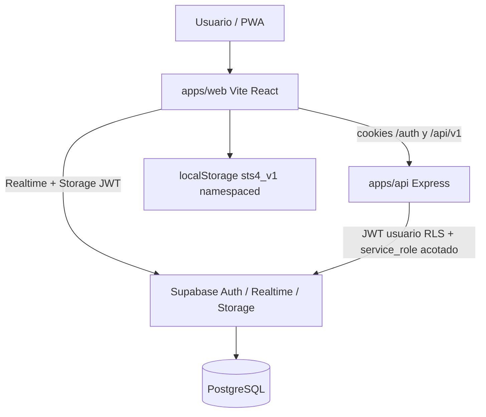
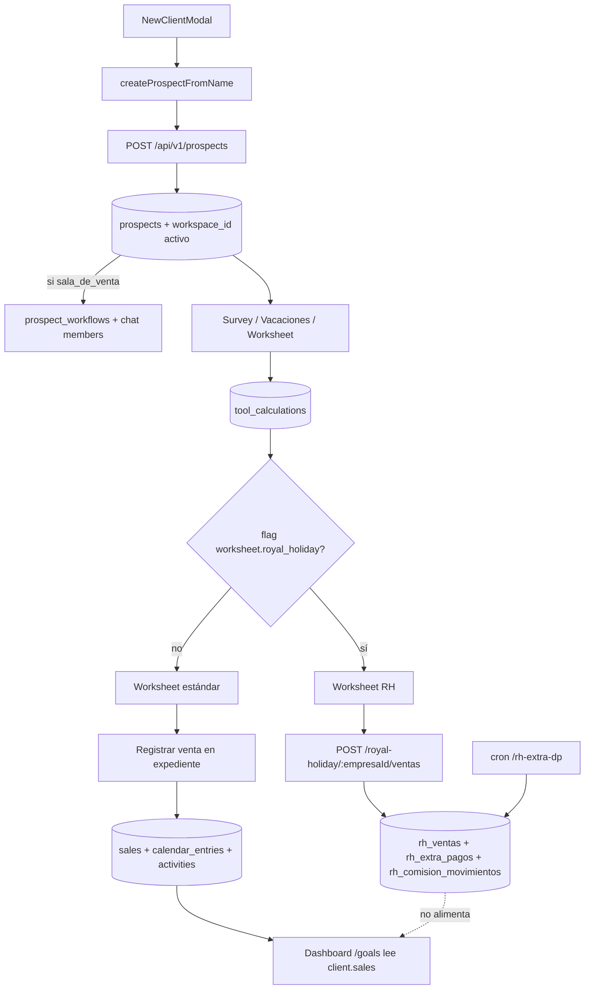
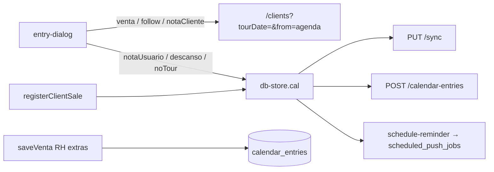
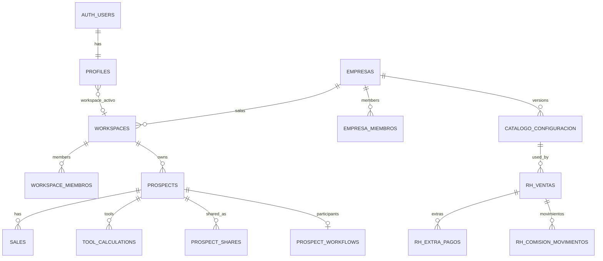
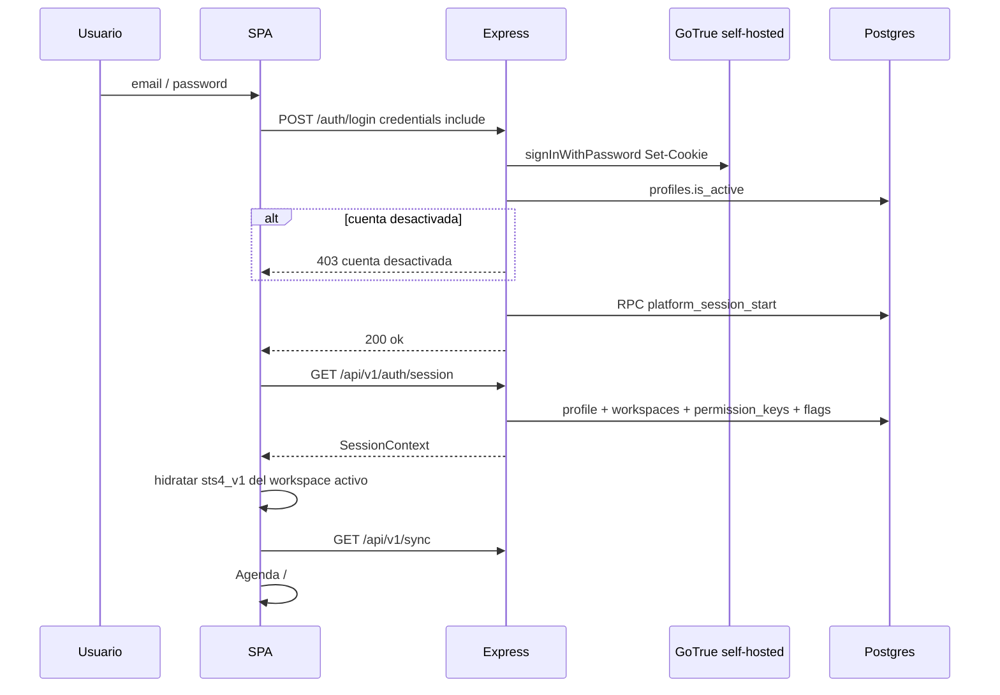

# Saletse — Mapa general del sistema

Documento de onboarding: cómo funciona el producto **de punta a punta**, según el código vigente (no specs históricas).

**Fecha de este recorte:** 2026-09-02.  
**Fuente:** `apps/web`, `apps/api`, `packages/shared`, `supabase/migrations` (`0001` … `0090`, gap histórico `0024`).  
**Qué no es este archivo:** no sustituye los documentos de detalle. Enlaza. Si un doc enlazado contradice el código, gana el código; las discrepancias conocidas están en [§7](#7-vigencia-respecto-a-otros-docs).

---

## Cómo leer este mapa

| Si necesitas… | Ve a |
|---------------|------|
| Experiencia por rol (menú, pantallas, recorrido de una venta) | [`FLUJO-USUARIO-POR-ROL.md`](./FLUJO-USUARIO-POR-ROL.md) |
| Experiencia en la sala Royal Holiday (tools RH, Premanifiesto, `rh_ventas`) | [`FLUJO-USUARIO-ROYAL-HOLIDAY.md`](./FLUJO-USUARIO-ROYAL-HOLIDAY.md) |
| Capas HTTP de la API (rutas → controllers → services → repos) | [`ARQUITECTURA-API.md`](./ARQUITECTURA-API.md) |
| Fórmula RBAC (rol ∪ overrides, sin techo plataforma∩empresa) | [`RBAC-ADDITIVE.md`](./RBAC-ADDITIVE.md) |
| Ficha de producto / stack / módulos | [`INFORMACION-TECNICA-SISTEMA.md`](./INFORMACION-TECNICA-SISTEMA.md) |
| Auditoría de egress (snapshot 2026-08-20; ver §7) | [`DIAGNOSTICO-EGRESS.md`](./DIAGNOSTICO-EGRESS.md) |
| Compartir expedientes, invites, chat de negociación | [`SHARING-ARCHITECTURE.md`](./SHARING-ARCHITECTURE.md) |
| Sync offline-first, outbox, PWA vs desktop | [`INFORME-SYNC-PWA-DESKTOP.md`](./INFORME-SYNC-PWA-DESKTOP.md) |
| Worksheet / catálogo Royal Holiday | [`royal-holiday/README.md`](./royal-holiday/README.md) · UX por puesto: [`FLUJO-USUARIO-ROYAL-HOLIDAY.md`](./FLUJO-USUARIO-ROYAL-HOLIDAY.md) |
| Corte Cloud → self-hosted VPS | [`PLAN-MIGRACION-VPS.md`](./PLAN-MIGRACION-VPS.md) |
| Snapshot RLS / VPS (2026-08-21) | [`inventario-vivo/README.md`](./inventario-vivo/README.md) |
| Catálogo HTTP vivo | [`apps/api/API.md`](../apps/api/API.md) y `GET /api/v1` |

Jerarquía de workspaces, asistentes y acceso cruzado: [`JERARQUIA-WORKSPACES-ENTREGABLE.md`](./JERARQUIA-WORKSPACES-ENTREGABLE.md).

---

## 1. Vista de 10.000 pies

Saletse es un SaaS de ventas (timeshare / clubes vacacionales) **multi-workspace**:

```
Plataforma
 └── Empresa (tenant)
      └── Sala de ventas (`workspaces.tipo = sala_de_venta`)
           └── Expedientes, ventas, agenda, tools, RH…
 └── Workspace personal (uno por usuario)
      └── Expedientes propios (se pueden transferir a sala; no se copian al pinnear)
```

La UI **no lee Postgres en vivo**. Lee un blob en `localStorage` (`sts4_v1:{workspaceId}`). PostgreSQL es la proyección eventual vía REST puntual + `GET/PUT /api/v1/sync` + Realtime de parches.



Stack resumido: Vite 6 + React 19 + React Router 7 + Zustand; Express 4; Postgres + Auth + Realtime + Storage (self-hosted en VPS de prod, ver [`PLAN-MIGRACION-VPS.md`](./PLAN-MIGRACION-VPS.md)). Auth de usuario: **email/password a través de la API** (`POST /auth/login`), no un login directo del SPA a GoTrue.

---

## 2. Flujo de datos y procesos de negocio

### 2.1 Recorrido de una venta (expediente → Dashboard)

Hay **dos caminos de venta independientes**. El Dashboard de producción (`/goals`) mide la tabla `sales` (blob `client.sales`). Royal Holiday escribe en `rh_ventas`. El worksheet RH **no** crea fila en `sales` (el campo `rh_ventas.sale_id` existe; la UI no lo envía).



#### Alta de expediente

1. UI: `NewClientModal` → `createProspectFromName` (`apps/web/src/actions/clients.js`).
2. Online-first: `persistProspectOnlineFirst` → `POST /api/v1/prospects` (`prospects-persist.js`). Offline: queda en el blob local + outbox.
3. API: `prospectsController.crearExpediente` → `createProspect` (permiso `expedientes:crear`). Insert con `workspace_id` del workspace activo.
4. Side-effects **solo en sala** (`ensureProspectSalaSideEffects`, no bloquean el HTTP): upsert `prospect_workflows` (representante = creador, gerente de la sala si existe) y RPC `sync_prospect_chat_members`.

El “pipeline” por etapas está **eliminado** (las rutas `advance` / `send-review` / `review` ya no existen). Lo que queda es el panel de **participantes** (`ProspectParticipantsPanel`): Gerente (solo lectura), Vendedor/Liner, Cerrador. Las claves `workflow:*` siguen en el catálogo porque el API de participantes las usa para capacidades.

Herramientas del expediente (`/clients/:id/{survey,vacaciones,worksheet,money-box,analysis}`) persisten JSON en `tool_calculations` vía `useToolSession` → `db-store.saveToolBucket` → `PUT /api/v1/tool-calculations`. El sync bulk **no** trae la columna `data` (solo metadata); el JSON se pide on-demand (`GET /tool-calculations`).

#### Worksheet: regular vs Royal Holiday

La misma ruta (`WorksheetPage`) decide en runtime:

```
useFlag("worksheet.royal_holiday")
  → flagsStatus === "unavailable"  → panel de reintento (no “módulo apagado”)
  → enabled                       → WorksheetRoyalHolidayPage
  → si no                         → WorksheetStandardPage
```

El flag llega en `GET /api/v1/auth/session` (`flags`), resuelto por RPC `resolver_session_flags`. No hay lógica en el cliente que “active RH al cambiar de workspace”: cambia la sesión, y con ella el mapa de flags. Catálogo RH es **por empresa** (`catalogo_configuracion.empresa_id`); las ventas RH se guardan con el `workspace_id` activo.

Detalle de variante, flags hijos y bootstrap: [`royal-holiday/README.md`](./royal-holiday/README.md).

#### Registrar venta de expediente (camino Dashboard)

1. `ClientDetail` → `saveClientSale` → `db-store.registerClientSale`.
2. Efectos locales: actualiza el prospecto, crea entrada de agenda (`venta` o `follow` si queda pendiente) y actividad.
3. Persistencia dual: REST inmediato (`POST/PATCH /sales` + prospect + calendar/activities) y, si falla o no hay red, outbox → `PUT /sync`.
4. Permiso API: `ventas:registrar`.
5. Si el status pasa a `cancelada`, `sales-service.actualizarVenta` llama `handleCancelacionVenta(saleId)` — eso **solo** encuentra `rh_ventas` si `sale_id` está poblado.

**Qué cuenta el Dashboard** (`GoalsPage` / `productionTourSaleCounts` / `getDashboardWeeks`): tours cuantificables del expediente y ventas con `isSaleCountable` (excluye `pendiente` y `cancelada`). Fuente: store local, alimentado por sync + Realtime de la tabla `sales`.

#### Venta Royal Holiday (camino comisiones)

1. Worksheet RH `save()` → `royalHolidayApi.saveVenta` → `POST /royal-holiday/:empresaId/ventas`.
2. `guardRhRequest` (membresía empresa + flag + workspace).
3. `saveVenta`: preview contra catálogo vigente → insert `rh_ventas` → extras en `rh_extra_pagos` + reminders `calendar_entries` tipo `follow` → movimiento inicial `rh_comision_movimientos` (`tipo: "inicial"`, `estado: "programada"`) → `processExtraDpJobs` inmediato para extras ya vencidos.
4. Extra DP a 90 días: cron `processDueExtraPagos` (o forfeit si el plazo venció). Recalcula comisión e inserta `diferencia_extra_dp`.
5. Resumen RH: `GET /royal-holiday/:empresaId/resumen` agrega `rh_ventas`, **no** `sales`.

Fórmulas (enganche, tiers, PMT Money Box RH): `packages/shared/src/calculations/royal-holiday.js` y `money-box.ts`.

### 2.2 Agenda



- Tipos en el diálogo: `venta`, `follow`, `notaCliente`, `notaUsuario`, `descanso`, `noTour`.
- **Venta / follow / nota de cliente desde el diálogo no escriben el calendario ahí**: navegan a Clientes con `tourDate` para crear o anotar sobre un expediente.
- Notas de usuario, descanso y no-tour sí van al store (`addCalEntry`) y de ahí a sync/REST.
- Relación con expedientes: `prospect_id` / `sale_id` en DB; en el blob local `clientId` / `prospectId` / `saleId`. Resolución UI: `resolve-entry-client.ts`.
- Edición/borrado API: **solo el dueño** (`user_id`), aunque `teamScope` permita *ver* entradas de compañeros.
- Push de recordatorios: `POST /api/v1/notifications/schedule-reminder` → `scheduled_push_jobs`. Digest al entrar y al volver a primer plano. Flush: cron diario + poll del cliente cada ~45 s mientras la app está abierta.

`RhCalendarWidget` es un calendario mensual **desacoplado** del store de agenda (Premanifiesto). Los calendarios de comisiones/descansos RH son páginas propias (`/tools/rh/calendario-comisiones`, `/ops/rh/calendario-descansos`).

### 2.3 Sync: `/api/v1/sync` y el blob local

Contrato HTTP: [`ARQUITECTURA-API.md`](./ARQUITECTURA-API.md) (envelope `{ data, syncedAt }`). Detalle histórico de roturas PWA: [`INFORME-SYNC-PWA-DESKTOP.md`](./INFORME-SYNC-PWA-DESKTOP.md). Diagnóstico de persistencia: [`DIAGNOSTICO-SYNC-PERSISTENCIA.md`](./DIAGNOSTICO-SYNC-PERSISTENCIA.md).

#### Qué se manda y qué se recibe

| Método | Cliente | Servidor |
|--------|---------|----------|
| `GET /api/v1/sync` | cookies de sesión | `pullAll` scoped por `workspace_activo_id` + `teamScope` → blob `AppDatabase` |
| `PUT /api/v1/sync` | `{ data: AppDatabase }` (también acepta el blob plano) | `normalizeIds` → `reconcile` (upsert propias + `pendingDeletes`) → `pullAll` de nuevo |

Tablas del bulk (6): `prospects`, `sales`, `calendar_entries`, `goals`, `activities`, `tool_calculations`.

`tool_calculations` en el pull: **solo** `id,user_id,workspace_id,prospect_id,tool,updated_at`. El JSON `data` se carga con `GET /tool-calculations`.

#### Resolución local vs remoto

Dos capas, no un LWW único:

1. **Servidor (`reconcile`)**: upsert. Gana el último PUT. **Nunca** borra filas remotas porque falten en el blob; borra solo vía `pendingDeletes`. En `teamScope`, solo reconcilia filas con `user_id ===` el usuario autenticado (no pisa ownership ajeno). `tool_calculations`: solo sube filas con `data` no vacío.
2. **Cliente (`mergeSyncDatabases`)**: LWW por timestamps (`updatedAt` / `_updatedAt` / `ts`). Filas solo locales se conservan. Settings de sala no se mezclan entre workspaces.

#### Claves de storage

| Clave | Scope | Contenido |
|-------|--------|-----------|
| `sts4_v1:{workspaceId}` | por sala/personal | blob CRM (`AppDatabase` sin prefs globales) |
| `sts4_user_v1` | global usuario | idioma, moneda, OneSignal, settings por workspace |
| `sts4_active_workspace` | dispositivo | último workspace activo |
| `sts4_outbound_v1:{workspaceId}` | por workspace | outbox durable (`dirty`, `generation`, `lastAckAt`) |
| `sts4_schema` | global | versión layout (= `2`, namespaced) |
| `sts4_account` | global | userId dueño del blob (guardia en SyncProvider) |

Schema 2 migra el legado plano `sts4_v1` y lo elimina. Al **cambiar de workspace** el adapter persiste la sala actual y carga la destino **sin copiar** `worksheetConfig` / `moneyBoxConfig` / `tourTypes`.

#### Orquestación (`SyncProvider`)

Al entrar (usuario autenticado):

1. Alinear cache local al workspace de sesión.
2. `GET /sync` → merge LWW → `replaceDb` (sin disparar outbound).
3. Si outbox dirty / local ahead / `pendingDeletes` → `PUT /sync`.
4. Recovery de blob huérfano (`recoverLocalBlobToCloud`: `POST /prospects` de faltantes + PUT si hace falta).
5. Arranca Realtime de las 6 tablas.
6. Digest de recordatorios + loop de flush.

Mutación UI → `saveDatabase` → debounce **400 ms** → PUT. Offline: se escribe local, outbox dirty, push al volver `online` / foreground.

Workbox marca `/api/v1/sync` como **NetworkOnly** (nunca cachea el bulk).

#### Realtime vs sync

Hoy el dashboard **no** hace pull completo por cada evento (eso es lo que documentaba [`DIAGNOSTICO-EGRESS.md`](./DIAGNOSTICO-EGRESS.md) en 2026-08-20; el código cambió):

- Canal filtrado por `workspace_id` (fallback `user_id`) → debounce 400 ms → `applyDashboardTableChange` (parche puntual al store, `runWithoutOutboundSync`).
- Tools: si el evento no trae JSON `data`, escribe stub `{ _pending, _stale }` y el JSON se pide aparte.
- Notificaciones in-app: canal **separado** (`direct_messages`, `chat_messages`, `user_connections`, `prospect_shares`, `support_request_replies`). No toca el blob CRM. Solo desktop.
- Pins: canal `clients-pinned-prospects` → `GET /api/v1/shares/workspace`. Fuera del bulk.

`requestSyncRefresh` (pull+merge) se usa al abrir Clientes, al cambiar workspace y tras transfer/duplicate — no en el hot path de Realtime del dashboard.

### 2.4 Procesos asíncronos / crons

Tres endpoints, todos con `authorizeCron` (`Authorization: Bearer CRON_SECRET` o header `x-cron-secret`). Sin secreto → 401 `"Unauthorized"`.

| Endpoint | Qué dispara | Horario en `vercel.json` y `/etc/cron.d/saletse` |
|----------|-------------|--------------------------------------------------|
| `/api/v1/cron/flush-reminders` | `flushDueScheduledPushes({ limit: 80 })` — jobs `pending` con `send_at <= now` en `scheduled_push_jobs`; push OneSignal; hasta 5 reintentos | `0 9 * * *` UTC |
| `/api/v1/cron/cleanup-support-attachments` | `cleanupExpiredSupportAttachments({ limit: 80 })` — tickets resueltos/cerrados, adjuntos > 90 días, bucket `soporte-adjuntos` | `0 10 * * *` UTC |
| `/api/v1/cron/rh-extra-dp` | `processExtraDpJobs({ limit: 200 })` = forfeit de Extra DP vencidos + `processDueExtraPagos` (recalcula comisión). Corre con **service role** | `15 8 * * *` UTC |

Además (no son crons de servidor):

- Poll cliente ~45 s → `POST /api/v1/notifications/flush-reminders` (usuario autenticado, límite 20).
- `processExtraDpJobs` también al guardar una venta RH.
- No hay `pg_cron` en migraciones. PM2 (`saletse-api`) no define crons: los dispara crontab VPS / Vercel Cron.

El catálogo `GET /api/v1` lista flush, cleanup y `rh-extra-dp`, más un índice compacto de recursos Royal Holiday.

---

## 3. Estructura de base de datos

Última migración en repo: **`0090_empresa_admin_exclude_capa_admin.sql`**. Inventario de políticas RLS (133 en checkpoint Cloud 2026-08-21): [`inventario-vivo/`](./inventario-vivo/README.md). No se listan aquí.

### 3.1 Dominios y relaciones



#### Workspaces / empresas / roles

`profiles` (FK `auth.users`, `workspace_activo_id`, `is_super_admin`, `role_id`) · `empresas` · `workspaces` (`personal` \| `sala_de_venta`, `empresa_id` en sala) · `workspace_miembros` · `empresa_miembros` · `roles` / `permisos` / `rol_permisos` · `usuario_permisos_override` · `workspace_usuario_permisos_override` · `paquetes_acceso` / `paquete_flags` · `flags` / `flag_reglas` · `permisos_delegados` · `gerente_acceso_cruzado` · `planes` / `membresias` · `platform_sessions` · `logs_administracion`.

#### Prospects / expedientes

`prospects` (`workspace_id` NOT NULL, `user_id` = dueño) · `prospect_shares` (**`added_to_workspace_at`** = pin) · `prospect_share_invites` · `share_permission_requests` · `prospect_workflows` (1:1, participantes; no pipeline) · `prospect_workflow_events` · `prospect_archivos` · `modulo_custom_datos`.

#### Operación diaria

`sales` · `calendar_entries` (`prospect_id`, `sale_id`) · `activities` · `goals` (`user_id` + `year` + `month`).

#### Tools

`tool_calculations`: unique `(user_id, prospect_id, tool)`; `prospect_id` null = modo libre; `tool` ∈ `survey` \| `vacaciones` \| `worksheet`; JSON en `data`.

#### Chat / red / notificaciones

`chat_conversations` / `chat_members` / `chat_messages` · `user_connections` · `direct_messages` · `push_subscriptions` · `scheduled_push_jobs` · `notification_cooldowns` (deny-by-default, service role). **No hay** tabla `notifications` genérica.

#### Catálogo y ops Royal Holiday

`catalogo_configuracion` → `rh_bottom_line`, `rh_financiamiento`, `rh_comisiones`, `rh_regalos`, `rh_costo_administrativo`, `rh_parametros_generales` · `rh_ventas` (`empresa_id`, `workspace_id`, `prospect_id`, `sale_id` opcional) · `rh_extra_pagos` · `rh_comision_movimientos` · ops `0077+`: `rh_dias_descanso`, `rh_ops_config`, `rh_premanifiesto`, `rh_linea_*`, `rh_okr`, `rh_propinas` · `rh_money_box_config` (`0086`) · `rh_premanifiesto_ola_config` (`0087`).

#### Survey / soporte

`survey_preguntas` (+ overrides de usuario) · `support_requests` / `support_request_replies`.

Frontera: RPC `workspace_boundary_ok` / `transfer_prospect_to_sala` — no mover ni duplicar entre `personal` ↔ `sala_de_venta` salvo los caminos explícitos.

### 3.2 TEAM_TABLES vs personales (sync)

Definido en `packages/shared/src/data/sync.js`:

**TEAM_TABLES** (con `teamScope=true` el pull **no** filtra `user_id`; solo `workspace_id`):

`prospects`, `sales`, `activities`, `tool_calculations`, `calendar_entries`.

**Fuera de TEAM_TABLES** (siempre `user_id`): **`goals`**.

`teamScope` se enciende si el workspace activo es `sala_de_venta` **y** el RPC `workspace_has_permission(..., "dashboard:ver_equipo")` es true. Si ese RPC falla, el código pone `teamScope = false` (degrada a “solo míos”, no a 503).

### 3.3 Expediente único, referencia nunca copia

No hay columna `pin` en `prospects`. El pin es:

| Pieza | Dónde |
|-------|--------|
| Timestamp | `prospect_shares.added_to_workspace_at` (`0028`) |
| Permiso | enum `share_permission` incluye `workspace`; `share_can_edit` = `edit` \| `workspace` |
| API pin | `POST /api/v1/shares/:id/add-to-workspace` → `UPDATE … SET added_to_workspace_at = now()` si era null |
| Lectura | `GET /api/v1/shares/workspace` lee **filas vivas de `prospects`**, no una copia. Comentario en código: *“Datos del recurso vivo (prospects), nunca de una copia de la referencia/pin.”* |
| UI | estado React en Clientes; href `/red/contacto/{owner_id}/expediente/{prospect_id}` |

**Copia explícita** (otro id): `duplicateProspect`. **Mismo id, otro workspace**: `transferPersonalToSala` / RPC `transfer_prospect_to_sala`.

Los pins **no entran** al blob `sts4_v1` del receptor.

Detalle de shares/chat: [`SHARING-ARCHITECTURE.md`](./SHARING-ARCHITECTURE.md) (el enum ahí lista `view|edit|comment`; `workspace` se añadió en `0028`).

### 3.4 RLS — patrón, no inventario

Casi todas las tablas de negocio tienen RLS. Patrón general post-`0052`:

1. **Operación CRM** (`prospects`, `sales`, `calendar_entries`, `activities`, `tool_calculations`, `goals`): `user_in_workspace(auth.uid(), workspace_id)`. INSERT suele exigir además `auth.uid() = user_id`. Encima hay políticas de **share** (`prospects_select_shared`, update si `share_can_edit`).
2. **Tenant** (`empresas`, `workspaces`, miembros, paquetes): `user_in_empresa` / admin de empresa / superadmin.
3. **RH**: `rh_can_access_empresa(empresa_id)` a SELECT; write también `is_super_admin()`.
4. **Deny-by-default**: tablas sin policy authenticated (p. ej. `notification_cooldowns`) → solo `service_role`.

Ejemplos representativos (nombres de policy pueden haber sido re-creados en migraciones posteriores; la **condición** es lo estable):

```sql
-- 0052: miembro de la sala ve expedientes de esa sala
create policy "prospects_select_member" on public.prospects
  for select to authenticated
  using (public.user_in_workspace(auth.uid(), workspace_id) or exists (… prospect_shares …));

-- 0052: alta solo como dueño y miembro
create policy "prospects_insert_member" on public.prospects
  for insert to authenticated
  with check (auth.uid() = user_id and public.user_in_workspace(auth.uid(), workspace_id));

-- 0078: ops RH por empresa, no por user_id
create policy rh_premanifiesto_select on public.rh_premanifiesto
  for select to authenticated
  using (public.rh_can_access_empresa(empresa_id));
```

La API **no se fía solo de RLS**: `requireWorkspacePermission` / `requireWorkspaceFlag` fallan cerrado (403/503). Fórmula de claves: [`RBAC-ADDITIVE.md`](./RBAC-ADDITIVE.md). Aislamiento Superadmin/Admin vs CRM fila a fila: [`VERIFICACION-PRIVACIDAD-ADMIN.md`](./VERIFICACION-PRIVACIDAD-ADMIN.md).

---

## 4. Estructura del frontend (`apps/web`)

### 4.1 Carpetas

| Ruta | Rol |
|------|-----|
| `src/routes/index.jsx` + `lazy-pages.js` | Routing SPA |
| `src/pages/` | Auth, admin, RH, network, tools hub |
| `src/components/` | UI por dominio (`calendar/`, `clients/`, `calculators/`, `admin/`, `rh/`, `auth/`, `layout/`, `providers/`) — varias “páginas” viven aquí (`calendar-page`, `clients-page`, `goals-page`) |
| `src/layouts/` | `AuthLayout`, `DashboardLayout`, `AdminSection` |
| `src/stores/` | Zustand (tres stores) |
| `src/hooks/` | Sesión, flags, workspace, tools, RH |
| `src/lib/` | Cliente API (`*-api.js`), storage, sync, cálculos, PWA, i18n |
| `src/actions/` | Orquestación UI (clients, sales, calendar, settings) |

### 4.2 Estado global

Solo **Zustand**, tres stores:

| Store | Archivo | Qué guarda |
|-------|---------|------------|
| `useDbStore` | `stores/db-store.ts` | blob CRM; toda mutación llama `saveDatabase` |
| `useSyncStore` | `stores/sync-store.ts` | `status`, `lastSyncedAt`, pendiente de outbox |
| `useAppStore` | `stores/app-store.ts` | UI: mes del calendario, sidebar, `toolMode`, `activeClientId` |

No hay Context de datos CRM. Sesión/permisos/flags se observan con `watchSession` (`session-api.js`) — no es un store Zustand.

Providers en `DashboardLayout`: `StoreHydration` (lee localStorage al boot, **sin** llamar sync) → `SyncProvider` → tipos de cambio, presencia, OneSignal, coordinadores de push y toasts.

Capa HTTP del SPA: `fetch("/api/v1/…", { credentials: "include", cache: "no-store" })`. Auth cookies en `/auth/*` (fuera de `/api/v1`, montado desde `app.js`).

### 4.3 Offline / outbox

Ver §2.3. Resumen operativo: UI siempre escribe local; REST puntual (`cloud-persist.js` / `prospects-persist.js`) si hay red; si no, `markOutboxDirty` y el PUT bulk cierra la brecha. Deletes remotos **solo** con `pendingDeletes`.

### 4.4 PWA y pipeline de deploy

**Build-id**

1. Plugin Vite escribe `dist/build-id.txt` y embebe `VITE_BUILD_ID`.
2. `ensureFreshBuild()` (antes de montar React, y en focus/visibility/online) compara el id embebido con `GET /build-id.txt` (NetworkOnly). Si difieren: purge de caches + reload (máx. 3 intentos). **No** borra `localStorage`.
3. Workbox: `skipWaiting: true`, `clientsClaim: true`, `registerType: "autoUpdate"`. El cliente además manda `{ type: "SKIP_WAITING" }` al worker en waiting. `controllerchange` → reload.
4. `index.html`, `/sw.js`, `/build-id.txt`, `/api/v1/sync` y el entry `index-*.js` son NetworkOnly. No se precachea `index.html`.

**Deploy web prod (VPS) — orden correcto**

1. `scripts/build-web-vps-prod.py` — toma `VITE_SUPABASE_URL` / anon del `.env` de Express en la VPS (self-hosted), **no** de `.env.local` de Cloud; corre `npm run build:web`; llama la guardia.
2. `scripts/spa_selfhosted_guard.py` — **falla** si el `dist` contiene `*.supabase.co` o el ref Cloud `ihuyisrplbmgxnvkpifm`; exige la IP `187.77.14.148` en el JS.
3. `scripts/deploy-web-dist-prod.py` — tar + SFTP a `/var/www/Saletse/apps/web/dist`; deja stubs ESM para chunks de entry ya retirados (evita que un SW viejo rehidrate Cloud).

Un `npm run build:web` local con `.env.local` de Cloud **no** se debe subir a prod: el propio header del script de build lo advierte (corte 2026-08-22).

`vercel.json` sigue existiendo (alias, crons, rewrites). El hosting que el código de deploy trata como prod self-hosted es la VPS. Estado del corte Cloud/Vercel: [`PLAN-MIGRACION-VPS.md`](./PLAN-MIGRACION-VPS.md).

### 4.5 Worksheet como “vertical”

No hay un router distinto por tenant. Una sola página, un flag de sesión:

| Flag | Efecto |
|------|--------|
| `worksheet` | herramienta visible (gate de permiso/flag) |
| `worksheet.royal_holiday` | sustituye el worksheet estándar por el RH |
| `worksheet.royal_holiday.money_box` | pestaña Money Box **dentro** del RH (catálogo `rh_money_box_config`) |
| `worksheet.money_box` o plan PRO | Money Box standalone (`/tools/money-box`, `/clients/:id/money-box`) |

Flags RH de ops/tools: `rh.tool.*` (`tool-flags.js`). Hub: `/tools` y `/ops/rh/*`.

---

## 5. Flujo de usuario desde login



### 5.1 Login

- UI: `LoginPage` → `POST /auth/login` con cookies (`credentials: "include"`). Si ya hay sesión, `GET /api/v1/auth/session` redirige a `next`.
- API: `signInWithPassword` vía cliente cookie de Supabase (URL = `SUPABASE_URL` del proceso; en VPS es self-hosted).
- `profiles.is_active === false` → signOut + 403 *“Tu cuenta fue desactivada…”*.
- Credenciales inválidas → 401. Auth no configurado / red → 503.
- `ProtectedRoute`: sin `session.user` → `/login`. Excepción: URLs con `?code=` de recovery no se tiran a login pelado.

Registro / recover / reset: mismas rutas `/auth/*` (`register`, `forgot-password`, `reset-password`, `exchange-code`, `callback`).

### 5.2 Resolución de sesión

`GET /api/v1/auth/session` (`session-service.getSession`) arma:

- `user`, `profile` (plan, `permission_keys`, `flags`, `workspace_activo_id`)
- `permission_keys` + `permissions_status` (`ok` \| `unavailable`)
- `flags` + `flags_status` (`ok` \| `unavailable`)
- `workspaces`, `workspace_activo`, `membership`, `premiumFeatures`

Permisos:

- Superadmin plataforma (`is_super_admin` + `role === "admin"`): catálogo global.
- **Sala:** solo RPC `effective_workspace_permissions`. Si falla → `keys: []`, `status: "unavailable"` (la UI reintenta; no se cae a `profiles.role_id`).
- Personal: `profiles.role_id` ∪ overrides `usuario_permisos_override`.

Flags: RPC `resolver_session_flags`. En sala, fallo → `{ flags: {}, status: "unavailable" }` (fail-closed). Detalle RBAC: [`RBAC-ADDITIVE.md`](./RBAC-ADDITIVE.md).

Workspace activo: `listUserWorkspaces` + `resolveActiveWorkspaceId`; se persiste en `profiles.workspace_activo_id` si hacía falta.

### 5.3 Al entrar

`DashboardLayout` monta hidratación local + `SyncProvider` (§2.3) + Realtime + digest de recordatorios + OneSignal. Navegación inicial: **Agenda** (`/`).

### 5.4 Navegación principal

Fuente: `nav-config.js` (sidebar + bottom nav). Visibilidad según tipo de workspace / rol / feature.

| Label | Ruta | Notas |
|-------|------|--------|
| Agenda | `/` | index |
| Metas | `/metas` | |
| Clientes | `/clients` | `/expedientes` y `/workflow` redirigen aquí |
| Mi equipo | `/team` | `gerenteOnly`, solo sidebar |
| Dashboard | `/goals` | KPIs de `sales` / tours |
| Herramientas | `/tools` | + vertical RH si flags |
| Ventas | `/sales` | feature `sales:history` |
| Red | `/network` | solo workspace **personal** |
| Chat equipo | `/messages?scope=team` | solo **sala** |
| Mensajes | `/messages` | solo personal |
| Admin | `/admin` | si `isAdmin` |
| Ajustes | `/settings` | fuera del grupo principal |

Herramientas en expediente: `/clients/:id/{survey,vacaciones,worksheet,money-box,analysis}`. Compartidos: `/red/contacto/:contactId/expediente/:prospectId/…`. Ops RH: `/ops/rh/*` (Premanifiesto lleva `RhPremanifiestoGate`). Admin: overview, users, roles, modules, empresas, logs, goals, tools, support; rutas legacy redirigen.

### 5.5 Varios workspaces (switcher)

UI: `WorkspaceRail` / sheet en desktop; overlay `WorkspaceSwitchOverlay` mientras cambia.

`switchWorkspace(id)`:

1. `POST /api/v1/auth/workspace` `{ workspace_id }` → recalcula sesión.
2. `applyWorkspaceLocalDatabase` (blob de esa sala, sin copiar configs).
3. Branding CSS (`--ws-brand-primary`, `--navy`, …).
4. `workspace:changed` → `requestSyncRefresh({ force })` + reinicio Realtime.

Abandonar sala: `POST /api/v1/workspace/leave`.

### 5.6 Flujos de fallo (503 vs 403)

Códigos en `apps/api/src/lib/workspace-permission-rpc.js`:

| Código | HTTP | Significado | Qué ve el usuario |
|--------|------|-------------|-------------------|
| `WORKSPACE_PERMISSIONS_UNAVAILABLE` | 503 | RPC de permisos de sala caído — **no** es “sin permiso” | Banner o panel `PermissionsUnavailableNotice` *“No se pudieron verificar los permisos de la sala”* + **Reintentar** (`notifyAuthChanged` → re-fetch sesión) |
| `WORKSPACE_FLAGS_UNAVAILABLE` | 503 | RPC de flags caído — **no** es “módulo apagado” | Mismo componente `kind="flags"`; `FlagsUnavailableGate` / `ToolPermissionGate` / Worksheet |
| `WORKSPACE_PERMISSION_DENIED` | 403 | Miembro sin esa clave | *“No tienes permiso para realizar esta acción.”* |
| `WORKSPACE_ACCESS_DENIED` | 403 | JWT ok pero sin membresía (ni acceso cruzado) | *“No tienes acceso a este espacio.”* |
| `WORKSPACE_FLAG_DENIED` | 403 | Módulo off | *“Módulo no habilitado.”* |

En sala, sesión degradada (`permissions_status` / `flags_status === "unavailable"`): `can()` e `isEnabled()` son fail-closed (`false`), pero la UI **no** dice “acceso denegado”: muestra reintento. `DashboardLayout` pone el banner si cualquiera de los dos status está `unavailable`.

No existe un componente llamado `503RetryPanel`: es `PermissionsUnavailableNotice` (`variant="banner"` \| `"panel"`).

Cuenta desactivada en login: 403 específico, no usa estos códigos.

---

## 6. Índice rápido de código

| Tema | Ruta |
|------|------|
| Login | `apps/web/src/pages/LoginPage.jsx`, `apps/api/src/controllers/auth-controller.js` |
| Sesión | `apps/api/src/services/session-service.js`, `apps/web/src/lib/session-api.js` |
| Switch workspace | `apps/web/src/hooks/use-workspace.js` |
| Sync API | `apps/api/src/routes/sync.js`, `packages/shared/src/data/sync.js` |
| Sync UI | `apps/web/src/components/providers/sync-provider.jsx`, `sync-merge.js`, `sync-outbox.js` |
| Storage keys | `apps/web/src/lib/storage/keys.ts` |
| TEAM_TABLES / teamScope | `packages/shared/src/data/sync.js`, `apps/api/src/lib/workspace-scope.js` |
| Códigos 403/503 | `apps/api/src/lib/workspace-permission-rpc.js` |
| Expedientes | `apps/api/src/services/prospects-service.js`, `apps/web/src/actions/clients.js` |
| Ventas CRM | `apps/api/src/services/sales-service.js`, `apps/web/src/stores/db-store.ts` |
| Ventas RH | `apps/api/src/services/royal-holiday-service.js` |
| Pin | `apps/api/src/services/sharing-service.js` (`addShareToWorkspace`, `listWorkspacePinned`) |
| Worksheet vertical | `apps/web/src/components/calculators/worksheet-page.jsx` |
| Crons | `apps/api/src/routes/cron.js` |
| PWA | `apps/web/src/lib/pwa-register.js`, `ensure-fresh-build.js`, `vite.config.js` |
| Deploy web | `scripts/build-web-vps-prod.py`, `deploy-web-dist-prod.py`, `spa_selfhosted_guard.py` |

---

## 7. Vigencia respecto a otros docs

Útil al incorporar a alguien: estos archivos **siguen siendo la fuente de su tema**, pero algunos párrafos ya no describen el código de hoy.

| Doc | Qué sigue válido | Qué está desfasado respecto a este recorte |
|-----|------------------|--------------------------------------------|
| [`INFORMACION-TECNICA-SISTEMA.md`](./INFORMACION-TECNICA-SISTEMA.md) | Actores, módulos, ER simplificado, capas de auth | Cita prod Vercel y migraciones hasta `0075` (repo: `0090`). Login dibujado SPA→Auth directo (hoy: SPA→`POST /auth/login`). Debounce sync ~1.2 s (código: 400 ms). Realtime → “force pull” (código: parche puntual). |
| [`DIAGNOSTICO-EGRESS.md`](./DIAGNOSTICO-EGRESS.md) | Pregunta de negocio (cuota egress), listados `select('*')` REST, Realtime de chat sin filtro | Afirma que sync baja todo `tool_calculations.data` y que Realtime dispara `GET /sync`. Hoy el pull de tools es metadata y el dashboard aplica `applyDashboardTableChange`. |
| [`INFORME-SYNC-PWA-DESKTOP.md`](./INFORME-SYNC-PWA-DESKTOP.md) | Modelo offline-first, outbox, NetworkOnly | Clave plana `sts4_v1` (hoy namespaced `sts4_v1:{workspaceId}`, schema 2). |
| [`SHARING-ARCHITECTURE.md`](./SHARING-ARCHITECTURE.md) | view/edit/comment, invites, chat tipado | No documenta permiso `workspace` ni `added_to_workspace_at`. |
| [`PLAN-MIGRACION-VPS.md`](./PLAN-MIGRACION-VPS.md) | Inventario self-hosted, fases, riesgos | Número de migraciones del propio plan (habla de `0084`); el repo llegó a `0090`. |
| Catálogo `GET /api/v1` | Índice de rutas (incluye cron RH y `royalHoliday`) | Si se añaden endpoints nuevos, hay que actualizar `routes/v1.js`. |

---

*Fin del mapa. Para fórmulas RBAC, capas MVC y RH, no copiar de aquí: seguir los enlaces de la tabla inicial.*
